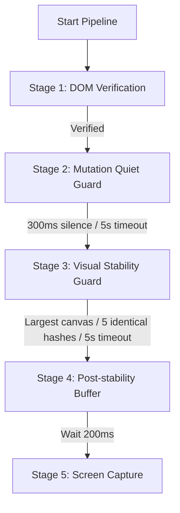

# TradingView Visual-First Readiness Migration

This document details the simplification of the TradingView capture pipeline by migrating from internal state APIs to a purely deterministic, client-side, visual-first verification approach.

---

## 1. Modified Files

- **[content.js](file:///d:/10. ict-scholar-agents-V1/extension/content.js)**:
  - Updated `VisualStabilityGuard` to locate and sample the largest visible chart canvas on the page.
  - Implemented FNV-1a 32-bit hash calculations on a 64x64 offscreen canvas rendering.
  - Configured visual stability to poll every 100ms and require exactly **5 consecutive identical hashes** to verify stability.
  - Refactored `runReadinessSequence` to follow the visual-first flow: DOM Verification $\rightarrow$ Mutation quiet period $\rightarrow$ Visual stability $\rightarrow$ Post-stability buffer.
  - Deleted legacy `queryInternalState()`, `awaitSeriesStability()`, and associated event listeners.

- **[bridge.js](file:///d:/10. ict-scholar-agents-V1/extension/bridge.js)**:
  - Removed `QUERY_TV_STATUS` message listener block completely.
  - Removed evaluation/queries of internal objects like `chartWidgetCollection`, `activeWidgetVal`, `model()`, `mainSeries()`, `loadingEvents()`, drawings, and study states.
  - Preserved `CHANGE_SYMBOL_AND_RESOLUTION` handler to maintain support for client-side navigation.

---

## 2. Deleted Readiness Code Paths

- **`QUERY_TV_STATUS`**: The bridge no longer responds to status checks or polls state parameters.
- **`TV_STATUS_RESPONSE`**: Deleted custom event handling in both the bridge and content scripts.
- **`BRIDGE_NOT_READY`**: Removed status evaluations that blocked capture when internal series/drawings had not finished calculating.
- **`mainSeriesLoading`, `drawingsLoading`, `studiesLoading`, `isSymbolResolved`**: Eliminated entirely from the readiness evaluation logic.

---

## 3. New Readiness Flow Diagram



---

## 4. Expected Latency Improvement

- **Zero API Polling Overhead**: Eliminating `QUERY_TV_STATUS` polling (which occurred every 100ms and sent postMessages back and forth) saves CPU resources.
- **Faster Stabilization**: Instead of waiting for background drawings/studies to resolve database sync (which frequently timed out or stayed stuck), the pipeline captures immediately when the canvas visual output stops changing.
- **Estimated Latency Reduction**: **1,000ms – 4,000ms** per capture cycle on standard layouts, and prevents 100% of the 5,000ms-15,000ms stabilization timeouts previously caused by stuck indicators or drawings.

---

## 5. Rollback Instructions

To roll back this migration and restore the legacy internal object checks:
1. Revert changes to [content.js](file:///d:/10. ict-scholar-agents-V1/extension/content.js) using:
   ```bash
   git checkout HEAD -- extension/content.js
   ```
2. Revert changes to [bridge.js](file:///d:/10. ict-scholar-agents-V1/extension/bridge.js) using:
   ```bash
   git checkout HEAD -- extension/bridge.js
   ```
