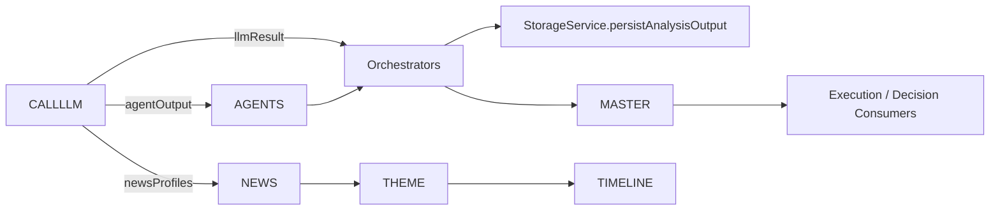

## LLM Call Inventory

This file enumerates all discovered LLM invocation points in the repository and provides dependency/prompt/output/token graphs and optimization candidates.

---

**Legend**: For each entry items 1–17 follow the user's requested ordering.

### Discovered LLM Calls (inventory)

1) Component Name: HTF Orchestrator
- File Path: [core/3.query/orchestrators/htf-orchestrator.ts](core/3.query/orchestrators/htf-orchestrator.ts)
- Function Name: `runHTFOrchestrator`
- Direct or Indirect Call: Direct (`callLLM`)
- Prompt Source: `buildPrompt(...)` called in-file producing `prompt` (uses `combinedInput` and `hydrationContext`)
- Prompt Builder: `buildPrompt` (imported from [core/3.query/prompt-builder.ts](core/3.query/prompt-builder.ts))
- Model Used: GEMINI_PRO_VISION (configured in `shared/utils/llm-utils.ts`)
- Temperature: 0.1 (default in `callLLM` generationConfig)
- Structured Output Schema: `HTFOrchestratorOutputSchema` (Zod schema passed via `schema`)
- Input Sources: `structureResult`, `macroResult`, `liquidityResult`, `pdArrayResult`, `hydrationContext` (weekly profile)
- Output Object: `HTFOrchestratorOutput` (returned as `llmResult`)
- Output Consumers: PMSO context update (pmso_context), `summarizeTimeframeThesis`, downstream orchestrators and StorageService
- Persisted Artifact: `StorageService.persistAnalysisOutput('htf','htf-orchestrator', finalOutput)` → stored finalOutput
- Estimated Position In Execution Flow: Orchestration step — after parallel agent runs and before hierarchical thesis update (mid-pipeline)
- Can Be Cached? Yes (deterministic given same inputs; caching key = prompt hash computed in `callLLM`)
- Potential Duplicate Reasoning? Yes — other orchestrators (ITF/LTF/Master) perform similar synthesis patterns
- Optimization Opportunity: Cache by prompt hash, compact inputs (already performed), reuse structured function-calls to reduce retries

---

2) Component Name: News Reasoner
- File Path: [core/3.query/news-reasoner.ts](core/3.query/news-reasoner.ts)
- Function Name: `reasonAboutNews`
- Direct or Indirect Call: Direct (`callLLM`)
- Prompt Source: Inline template string assembled in-file (includes LIVE_EVENTS, chunks, PMSO, HTF_PROFILE)
- Prompt Builder: Inline (file-local)
- Model Used: GEMINI_PRO_VISION (via `callLLM`)
- Temperature: 0.1
- Structured Output Schema: JSON object as described in comment block (no Zod schema passed; `responseType: 'json'`)
- Input Sources: event object, rawChunks / scoredEvidence, liveEvents, pmso, htfProfile
- Output Object: `NewsReasoningResult` (object with pressures, citations, summaries)
- Output Consumers: Macro event pipelines, `theme-synthesizer`, `timeline-synthesizer`, downstream PMSO aggregation
- Persisted Artifact: Typically persisted by callers (e.g., StorageService in agent flows) — reasoning result flows into cognition pipelines
- Estimated Position In Execution Flow: News grounding / event-level reasoning (early-mid news pipeline)
- Can Be Cached? No (live_events and event.timestamp sensitive → low cacheability) — partial caching possible for identical event+chunks
- Potential Duplicate Reasoning? Medium — other daily/weekly reasoners may recapitulate some event-level logic
- Optimization Opportunity: Limit chunk context size, prefer structured schema (Zod) to reduce retries, precompute chunk summarization to reduce tokens

---

3) Component Name: Daily Context Reasoner
- File Path: [core/news/cognition/daily-context-reasoner.ts](core/news/cognition/daily-context-reasoner.ts)
- Function Name: `reasonAboutDay`
- Direct or Indirect Call: Direct (`callLLM`)
- Prompt Source: Inline template string built with `bridge` and `retrieval.rag.chunks`
- Prompt Builder: Inline (file-local)
- Model Used: GEMINI_PRO_VISION
- Temperature: 0.1
- Structured Output Schema: JSON only (no Zod schema; `responseType: 'json'`)
- Input Sources: Bridge (`today_catalysts`, `today_role`, calendar_bias), retrieved chunks (RAG)
- Output Object: `DailyContextProfile` (constructed from parsed LLM result and fallback)
- Output Consumers: Daily profile consumers, master orchestrator, PMSO hydration and UI display
- Persisted Artifact: `StorageService.persistAnalysisOutput` called by agent caller (when layer present) — profile used by hydration context
- Estimated Position In Execution Flow: NEWS-only daily context construction (mid pipeline in news cognition)
- Can Be Cached? Partially (if `bridge` and retrieval chunks identical) — usually No due to daily/time variance
- Potential Duplicate Reasoning? Medium — overlaps with weekly summaries and hierarchical summarizer
- Optimization Opportunity: Precompute compact retrieval slices; use structured schema to validate outputs and enable tool-calling

---

4) Component Name: Hierarchical Summarizer
- File Path: [core/3.query/hierarchical-summarizer.ts](core/3.query/hierarchical-summarizer.ts)
- Function Name: `summarizeTimeframeThesis`
- Direct or Indirect Call: Direct (`callLLM`)
- Prompt Source: Inline template string (agentOutputs + retrievedChunks + parentThesis)
- Prompt Builder: Inline
- Model Used: GEMINI_PRO_VISION
- Temperature: 0.1
- Structured Output Schema: JSON object specified in the prompt (no explicit Zod schema passed; `useStructured: true` used but no schema parameter)
- Input Sources: `agentOutputs` array, `retrievedChunks`, optional `parentThesis`
- Output Object: `TimeframeThesis` (bias, confidence, key_anchors, summary, supporting_chunks, opposing_evidence, shift_conditions)
- Output Consumers: Hydration context (parent thesis), scenario engine, orchestrators (LTF/ITF/HTF) and storage
- Persisted Artifact: Typically persisted into `hydrationContext.parent_thesis` by orchestrators and then persisted by StorageService
- Estimated Position In Execution Flow: Hierarchical memory update (after orchestrators produce timeframe outputs)
- Can Be Cached? Yes (cacheable by prompt/hash if inputs unchanged)
- Potential Duplicate Reasoning? Yes — multiple timeframe summarizers could duplicate
- Optimization Opportunity: Provide explicit Zod schema to `callLLM` to enable function/tool calling and reduce parsing retries; cache assembled thesis per input hash

---

5) Component Name: Cluster Naming (batch script)
- File Path: [core/3.query/cluster/cluster-naming.ts](core/3.query/cluster/cluster-naming.ts)
- Function Name: `callGemini` (used from `main`)
- Direct or Indirect Call: Indirect — wrapper `callGemini` calls `callLLM`
- Prompt Source: `buildPrompt(samples)` (inline builder in this script)
- Prompt Builder: Inline `buildPrompt` defined in the script
- Model Used: GEMINI_PRO_VISION
- Temperature: 0.1
- Structured Output Schema: None (script expects a JSON object but uses `safeParse` to tolerate shapes)
- Input Sources: Sampled chunk texts from `data/chunk_output` (local files)
- Output Object: JSON object with keys `concept`, `type`, `layer`, `agent` object
- Output Consumers: Writes to `data/knowledge_map.json` (persisted artifact)
- Persisted Artifact: `data/knowledge_map.json` (fs write in script)
- Estimated Position In Execution Flow: Offline batch processing / knowledge map generation (precomputation)
- Can Be Cached? Yes (batch-run results persisted; rerun only when chunks change)
- Potential Duplicate Reasoning? Low (one-off cluster labeling)
- Optimization Opportunity: Batch multiple clusters in a single LLM call; enforce structured schema to improve parse success

---

6) Component Name: LTF Orchestrator
- File Path: [core/3.query/orchestrators/ltf-orchestrator.ts](core/3.query/orchestrators/ltf-orchestrator.ts)
- Function Name: `runLTFOrchestrator`
- Direct or Indirect Call: Direct (`callLLM`)
- Prompt Source: `buildPrompt({...}, hydrationContext)` assembled in-file
- Prompt Builder: `buildPrompt` (imported)
- Model Used: GEMINI_PRO_VISION
- Temperature: 0.1
- Structured Output Schema: `LTFOrchestratorOutputSchema` (Zod schema provided)
- Input Sources: `structureResult`, `liquidityResult`, `pdArrayResult`, `triggerResult`, `hydrationContext.pmso_context`
- Output Object: `LTFOrchestratorOutput` (execute, direction, entry, confidence, reasoning, confluence_score)
- Output Consumers: `summarizeTimeframeThesis` for M15, StorageService.persistAnalysisOutput('ltf', ...), downstream master orchestrator
- Persisted Artifact: `StorageService.persistAnalysisOutput('ltf','ltf-orchestrator', finalOutput)`
- Estimated Position In Execution Flow: Final execution decision layer (late in pipeline)
- Can Be Cached? Yes (if inputs identical; careful with timing-sensitive trigger inputs)
- Potential Duplicate Reasoning? Yes — LTF logic synthesizes agent outputs similar to other orchestrators
- Optimization Opportunity: Cache common orchestration compact payloads; tighten schema + tool-calling to avoid retries

---

7) Component Name: Base Agent Runner
- File Path: [core/3.query/agents/shared/base-agent.ts](core/3.query/agents/shared/base-agent.ts)
- Function Name: `runBaseAgent`
- Direct or Indirect Call: Direct (`callLLM` is invoked here as the canonical agent LLM call)
- Prompt Source: `buildPrompt({...}, { parent_thesis })` built from pipeline grounding, retrieved chunks, and agent `buildInputContext`
- Prompt Builder: `buildPrompt` (imported from [core/3.query/prompt-builder.ts](core/3.query/prompt-builder.ts))
- Model Used: GEMINI_PRO_VISION
- Temperature: 0.1
- Structured Output Schema: Per-agent `config.schema` (Zod schema passed to `callLLM` when available)
- Input Sources: RAG retrieved chunks, grounded knowledge, expanded queries, pipeline outputs, agent config input
- Output Object: Per-agent output (generic `TOutput`), then compacted via `deriveCompactOutput`
- Output Consumers: Orchestrators, PMSO, StorageService (persisted when `config.layer` provided)
- Persisted Artifact: `StorageService.persistAnalysisOutput(config.layer, config.agentName, finalResult, ...)` when `config.layer` exists
- Estimated Position In Execution Flow: Agent boundary (RAG → grounding → LLM → mapping) — lower/mid pipeline
- Can Be Cached? Yes (agent outputs deterministic given same RAG/memory inputs and agent config; use prompt hash)
- Potential Duplicate Reasoning? High across agents if pipeline overlaps — many agents apply similar reasoning patterns over overlapping chunks
- Optimization Opportunity: Shared prompt templates, caching by prompt hash, image inline data size reduction, Zod enforced tool-calling

---

8) Component Name: ITF Orchestrator
- File Path: [core/3.query/orchestrators/itf-orchestrator.ts](core/3.query/orchestrators/itf-orchestrator.ts)
- Function Name: `runITFOrchestrator` (exported function)
- Direct or Indirect Call: Direct (`callLLM`)
- Prompt Source: `buildPrompt({...}, hydrationContext)` assembled in-file from combinedInput
- Prompt Builder: `buildPrompt`
- Model Used: GEMINI_PRO_VISION
- Temperature: 0.1
- Structured Output Schema: `ITFOrchestratorOutputSchema` (Zod schema)
- Input Sources: structureResult, liquidityResult, pdArrayResult, setupResult, input.htf/itf, hydrationContext
- Output Object: `ITFOrchestratorOutput` (itf_bias, entry_bias, setup_type, confidence, reasoning)
- Output Consumers: `summarizeTimeframeThesis` for H4, storage, downstream orchestrators
- Persisted Artifact: `StorageService.persistAnalysisOutput('itf','itf-orchestrator', finalOutput)`
- Estimated Position In Execution Flow: Intermediary orchestration (mid-late pipeline)
- Can Be Cached? Yes (if inputs stabilized)
- Potential Duplicate Reasoning? Yes — overlaps with HTF/LTF synthesis
- Optimization Opportunity: Use compacted inputs and shared schemas; reuse previously computed thesis where applicable

---

9) Component Name: Rerank (retrieval post-process)
- File Path: [core/3.query/rerank.ts](core/3.query/rerank.ts)
- Function Name: `rerank`
- Direct or Indirect Call: Direct (`callLLM`)
- Prompt Source: Inline prompt constructed from chunks and optional parentThesis
- Prompt Builder: Inline (file-local)
- Model Used: GEMINI_PRO_VISION
- Temperature: 0.1
- Structured Output Schema: text ranking (CSV of indices); `responseType: 'text'`
- Input Sources: query string, chunk text slices, optional parentThesis
- Output Object: string with comma-separated indices used to reorder `chunks`
- Output Consumers: retrieval pipeline (reordered chunks returned to caller)
- Persisted Artifact: None (transient ranking)
- Estimated Position In Execution Flow: Retrieval post-processing (shortly after RAG retrieval)
- Can Be Cached? Yes (cache by query+chunk fingerprint)
- Potential Duplicate Reasoning? Low (specific to ranking)
- Optimization Opportunity: Move rerank to a cheaper model or heuristic scoring; use smaller context windows; cache ranks for identical inputs

---

10) Component Name: Master Orchestrator
- File Path: [core/3.query/orchestrators/master-orchestrator.ts](core/3.query/orchestrators/master-orchestrator.ts)
- Function Name: top-level master orchestration (LLM call in the file near `captureId` use)
- Direct or Indirect Call: Direct (`callLLM`)
- Prompt Source: `buildPrompt({...}, validatedInput.hydration_context)` assembled in-file (PMSO + context)
- Prompt Builder: `buildPrompt`
- Model Used: GEMINI_PRO_VISION
- Temperature: 0.1
- Structured Output Schema: `RawMasterOutputSchema` (Zod schema passed)
- Input Sources: PMSO, validatedInput.hydration_context, alignment, temporalState
- Output Object: `MasterOutput` normalized by `normalizeMasterOutput`
- Output Consumers: final trade decision consumers, execution systems, StorageService
- Persisted Artifact: persisted by callers or StorageService usage in file (master decision persisted alongside PMSO)
- Estimated Position In Execution Flow: Final decision layer (end of pipeline)
- Can Be Cached? No (time-sensitive, captureId unique)
- Potential Duplicate Reasoning? Medium — overlaps with LTF/ITF synthesis, but master aggregates
- Optimization Opportunity: Reduce input size by passing compacted PMSO; cache intermediate orchestration artifacts; use function-calling schema strictly

---

11) Component Name: Macro Theme Synthesizer
- File Path: [core/news/cognition/theme-synthesizer.ts](core/news/cognition/theme-synthesizer.ts)
- Function Name: synthesizer main (calls `callLLM` inside file)
- Direct or Indirect Call: Direct (`callLLM`)
- Prompt Source: `combinedPrompt` (constructed from prompt template + `themePayload`)
- Prompt Builder: Inline in file
- Model Used: GEMINI_PRO_VISION
- Temperature: 0.1
- Structured Output Schema: JSON array of theme objects (expected by code; `responseType: 'json'` used)
- Input Sources: `evidencePairs`, chunk previews, reasoningResults
- Output Object: `MacroTheme[]` entries (theme, confidence, supporting_events, supporting_evidence)
- Output Consumers: timeline synthesis, weekly profile, storage
- Persisted Artifact: consumed and persisted by upstream pipeline components
- Estimated Position In Execution Flow: News cognition synthesis (mid pipeline)
- Can Be Cached? Partially (if evidencePairs identical) — usually No because events update
- Potential Duplicate Reasoning? Medium (weekly macro reasoner and theme synthesizer both summarize themes)
- Optimization Opportunity: Pre-aggregate evidencePairs; use structured schema and function calling

---

12) Component Name: Macro Timeline Synthesizer
- File Path: [core/news/cognition/timeline-synthesizer.ts](core/news/cognition/timeline-synthesizer.ts)
- Function Name: timeline synthesizer (calls `callLLM`)
- Direct or Indirect Call: Direct
- Prompt Source: `combinedPrompt` assembled from `prompt` + `timelinePayload`
- Prompt Builder: Inline
- Model Used: GEMINI_PRO_VISION
- Temperature: 0.1
- Structured Output Schema: JSON array of timeline nodes (`responseType: 'json'`)
- Input Sources: events, reasoningResults, themes
- Output Object: `TimelineNode[]`
- Output Consumers: UI timeline, PMSO narrative storage
- Persisted Artifact: persisted by pipeline components
- Estimated Position In Execution Flow: News timeline construction (mid pipeline)
- Can Be Cached? Partially
- Potential Duplicate Reasoning? Low-medium
- Optimization Opportunity: Limit timeline payload to top-N events; structured schema

---

13) Component Name: Scenario Engine
- File Path: [core/3.query/scenario-engine.ts](core/3.query/scenario-engine.ts)
- Function Name: `ScenarioEngine.generateScenarios`
- Direct or Indirect Call: Direct (`callLLM`)
- Prompt Source: Inline prompt string constructed from memory.theses, relational, scenarioMacroSummary, compactEvidence
- Prompt Builder: Inline
- Model Used: GEMINI_PRO_VISION
- Temperature: 0.1
- Structured Output Schema: JSON object with `scenarios` array (no explicit Zod passed; `useStructured: true` used)
- Input Sources: Hierarchical memory theses, retrieved chunks, optional newsModifier
- Output Object: `ScenarioMemory` (active_scenarios, archived_scenarios, uncertainty_notes)
- Output Consumers: scenario storage, planners, downstream simulation/trading logic
- Persisted Artifact: scenario memory stored in higher-level context or persistent store by callers
- Estimated Position In Execution Flow: Scenario construction (mid pipeline)
- Can Be Cached? Yes (if memory + retrievedChunks identical)
- Potential Duplicate Reasoning? Medium (overlap with hierarchical summarizer and orchestrators)
- Optimization Opportunity: Batch multiple scenario requests; use schema validation and caching

---

14) Component Name: Weekly Macro Reasoner
- File Path: [core/news/cognition/weekly-macro-reasoner.ts](core/news/cognition/weekly-macro-reasoner.ts)
- Function Name: weekly macro reasoning flow (LLM call present)
- Direct or Indirect Call: Direct (`callLLM`)
- Prompt Source: Inline prompt template (large JSON schema included in prompt)
- Prompt Builder: Inline
- Model Used: GEMINI_PRO_VISION
- Temperature: 0.1
- Structured Output Schema: JSON object expected with weekly fields (`responseType: 'json'`)
- Input Sources: events array, calendar/meta inputs
- Output Object: weekly macro profile object (dominant_theme, weekly_story_arc, pressures, etc.)
- Output Consumers: weekly profile builder, hierarchical memory, UI
- Persisted Artifact: persisted by pipeline (weekly profile storage)
- Estimated Position In Execution Flow: Weekly-level news cognition (higher-level news pipeline)
- Can Be Cached? Partially (only for identical weekly inputs)
- Potential Duplicate Reasoning? Medium (overlap with theme/timeline synthesizers)
- Optimization Opportunity: Use structured schema and function-calling; reduce token usage by trimming chunk previews

---

15) Component Name: Weekly Question Generator
- File Path: [core/news/cognition/weekly-question-generator.ts](core/news/cognition/weekly-question-generator.ts)
- Function Name: `generateWeeklyQuestions` (local export)
- Direct or Indirect Call: Direct (`callLLM`)
- Prompt Source: Inline prompt built from `importantEvents` and `payload`
- Prompt Builder: Inline
- Model Used: GEMINI_PRO_VISION
- Temperature: 0.1
- Structured Output Schema: `WeeklyQuestionSchema` (Zod schema passed in call)
- Input Sources: importantEvents, payload
- Output Object: `WeeklyQuestionSet` (structured question set)
- Output Consumers: prompt templates, human-in-the-loop or retrieval query construction
- Persisted Artifact: stored/used by weekly profile builder
- Estimated Position In Execution Flow: Downstream support for weekly analysis (mid pipeline)
- Can Be Cached? Yes (deterministic given same inputs)
- Potential Duplicate Reasoning? Low
- Optimization Opportunity: Generate full batch questions in one call; reuse schema to enforce tool-calling

---

16) Component Name: LLM Wrapper / Provider
- File Path: [shared/utils/llm-utils.ts](shared/utils/llm-utils.ts)
- Function Name: `callLLM`
- Direct or Indirect Call: This function performs the provider call (direct to GoogleGenAI via `genAI.models.generateContent`)
- Prompt Source: Received as parameter (`prompt`) — assembled by callers (see above)
- Prompt Builder: N/A (this is the provider wrapper)
- Model Used: GEMINI_PRO_VISION (`gemini-2.5-flash` constant)
- Temperature: 0.1 (set in `requestBody.generationConfig.temperature`)
- Structured Output Schema: Supports function-calling via `requestBody.tools` and accepts `options.schema` (Zod) to construct tool declaration
- Input Sources: `contents` argument (user/message parts), `options.schema` for tool-calling
- Output Object: Provider response parsed into JSON or function-call args; returns parsedOutput or raw text
- Output Consumers: All callers (agents, orchestrators, scripts) that invoke `callLLM`
- Persisted Artifact: none internally; callers persist as needed. `callLLM` logs traces to logger
- Estimated Position In Execution Flow: External provider boundary
- Can Be Cached? Yes (prompt hash computed inside `callLLM` and log available; caching layer not implemented)
- Potential Duplicate Reasoning? N/A (provider function)
- Optimization Opportunity: Implement a shared caching layer keyed by prompt hash + model config; reduce retries by using strict tool-calling and schemas; allow lower-cost model routing for rerank/short tasks

---

## A. LLM Call Inventory Table
- See the enumerated per-call entries above (1–16). Each entry includes the required 1–17 fields.

## B. LLM Dependency Graph (Mermaid)
```mermaid
graph LR
  subgraph Provider
    CALLLLM[callLLM (shared/utils/llm-utils.ts)]
  end

  subgraph Orchestrators
    HTF[HTF-Orchestrator]
    ITF[ITF-Orchestrator]
    LTF[LTF-Orchestrator]
    MASTER[Master-Orchestrator]
  end

  subgraph Agents
    BASE[runBaseAgent]
    RERANK[Rerank]
    SCENARIO[Scenario-Engine]
  end

  subgraph News
    NEWS_REASONER[News-Reasoner]
    DAILY[Daily-Context-Reasoner]
    THEME[Theme-Synthesizer]
    TIMELINE[Timeline-Synthesizer]
    WEEKLY[Weekly-Macro-Reasoner]
    WEEKLY_Q[Weekly-Question-Generator]
  end

  HTF --> CALLLLM
  ITF --> CALLLLM
  LTF --> CALLLLM
  MASTER --> CALLLLM

  BASE --> CALLLLM
  RERANK --> CALLLLM
  SCENARIO --> CALLLLM

  NEWS_REASONER --> CALLLLM
  DAILY --> CALLLLM
  THEME --> CALLLLM
  TIMELINE --> CALLLLM
  WEEKLY --> CALLLLM
  WEEKLY_Q --> CALLLLM

  CLUSTER[Cluster-Naming Script] --> CALLLLM
  CALLLLM --> GENAI[GoogleGenAI.models.generateContent]
```

## C. Prompt Dependency Graph (Mermaid)
```mermaid
graph TD
  subgraph PromptBuilders
    BUILD_PROMPT[buildPrompt (core/3.query/prompt-builder.ts)]
    INLINE_PROMPT[Inline prompt strings]
  end

  BUILD_PROMPT --> HTF
  BUILD_PROMPT --> ITF
  BUILD_PROMPT --> LTF
  BUILD_PROMPT --> MASTER
  BUILD_PROMPT --> BASE

  INLINE_PROMPT --> NEWS_REASONER
  INLINE_PROMPT --> DAILY
  INLINE_PROMPT --> HIERARCHICAL_SUMMARIZER
  INLINE_PROMPT --> RERANK
  INLINE_PROMPT --> CLUSTER

  HTF --> CALLLLM
  NEWS_REASONER --> CALLLLM
  RERANK --> CALLLLM
  CLUSTER --> CALLLLM
```

## D. Output Consumer Graph (Mermaid)


## E. Token Flow Graph (Mermaid)
```mermaid
graph LR
  RAG[Retrieval (RAG) / chunks] --> Grounded[Grounding / buildGrounded]
  Grounded --> buildPrompt
  buildPrompt --> callLLM
  callLLM --> genAI[GoogleGenAI.models.generateContent]
  genAI --> parse[parse/safeParse / functionCall args]
  parse --> validation[Zod validation in callLLM]
  validation --> finalOutput
  finalOutput --> persist[StorageService or caller persistence]
```

## F. Candidate Optimization Areas (brief)
- Add a shared caching layer in `callLLM` keyed by model + prompt hash + schema version to avoid duplicate calls for identical inputs.
- Route cheap tasks (rerank, short text transforms) to an inexpensive/text-only model or local heuristic before invoking Gemini.
- Enforce and expand Zod schemas & function-calling for more endpoints to reduce parse-retry loops (fewer retries and parse errors).
- Batch cluster or knowledge-map labeling (combine many clusters in one request) to reduce per-call overhead.
- Compact input payloads aggressively (top-K chunks, truncate long fields) before `buildPrompt` to reduce token cost.
- Persist prompt hash and response timestamp to enable TTL-based reuse (avoid re-evaluating stable theses).
- Add optional streaming/partial-result handling for long orchestrations to improve observability and early exits.

---

If you want, I can: run a targeted search to extract exact line references and add clickable anchors to each inventory row, or implement a caching prototype inside `shared/utils/llm-utils.ts`. Which would you like next?
