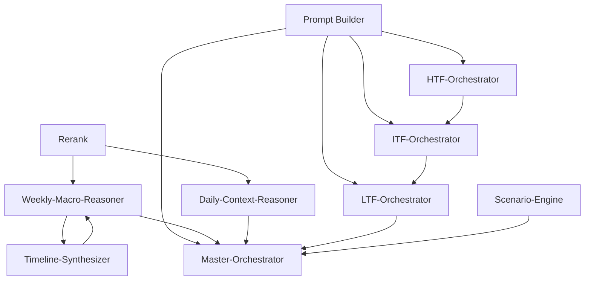
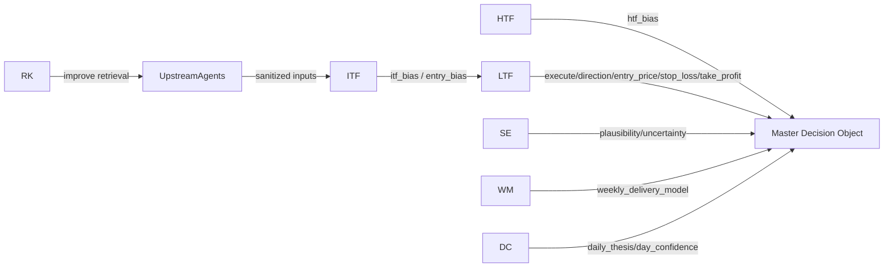

# 06 - Prompt Catalog

Summary: Inventory and mapping of prompts and LLM calls discovered in the repository (focused scan of `core/` and `shared/`). This file identifies prompt name, file path, prompt builder, LLM call, output schema, produced fields, consumers, and decision impact. Includes dependency graphs and consolidation suggestions.

**A. Prompt Catalog (selected, high-value prompts)**

- **Prompt Name:** Prompt Builder
  - **File Path:** core/3.query/prompt-builder.ts
  - **Prompt Builder:** `buildPrompt(config, hydrationContext)` (centralized builder used across orchestrators/agents)
  - **LLM Call:** Used to assemble prompt string passed into `callLLM` (builder only)
  - **Output Schema:** N/A (builder only)
  - **Produced Fields:** N/A (constructs prompt text)
  - **Consumers:** All orchestrators and many agents (Master-Orchestrator, LTF/ITF/HTF orchestrators, timeline/weekly/daily reasoners)
  - **Decision Impact:** NONE (builder itself), but enables all decision-driving prompts

- **Prompt Name:** Master Orchestrator Prompt
  - **File Path:** core/3.query/orchestrators/master-orchestrator.ts
  - **Prompt Builder:** `buildPrompt({...}, validatedInput.hydration_context)`
  - **LLM Call:** `callLLM(prompt, "Master-Orchestrator", captureId, [{ text: prompt }], { useStructured: true, schema: RawMasterOutputSchema })`
  - **Output Schema:** `RawMasterOutputSchema` / `MasterOutputSchema` (see `shared/contracts/canonical.ts`)
  - **Produced Fields:** `decision.execute`, `decision.state`, `decision.direction`, `decision.confidence`, `decision.score`, `decision.entry_zone`, `decision.notes`, optional `decision.stop_loss`/`decision.target` etc.; plus `layers`, `metadata`, `_raw`, `_debug`
  - **Consumers:** Execution layer, persistence (`StorageService`), downstream telemetry, risk gating
  - **Decision Impact:** HIGH — Direct master decision; affects all decision fields
  - **Decision Fields Affected:** execute ✓, direction ✓, confidence ✓, entry_zone ✓, stop_loss ✓, take_profit ✓ (via `decision` fields)

- **Prompt Name:** LTF Orchestrator Prompt
  - **File Path:** core/3.query/orchestrators/ltf-orchestrator.ts
  - **Prompt Builder:** `buildPrompt({...}, hydrationContext)`
  - **LLM Call:** `callLLM(prompt, "LTF-Orchestrator", ..., { tools: ltfTool, useStructured: true, schema: LTFOrchestratorOutputSchema })`
  - **Output Schema:** `LTFOrchestratorOutputSchema` (see `shared/contracts/canonical.ts`)
  - **Produced Fields:** `execute`, `direction`, `entry`, `entry_price`, `stop_loss`, `take_profit`, `confluence_score`, `confidence`, `dominant_factors`, `reasoning`, `_debug`, `_raw`
  - **Consumers:** Master Orchestrator (as part of compressed master input), trade execution modules, StorageService
  - **Decision Impact:** HIGH — Produces concrete trade executions and price levels
  - **Decision Fields Affected:** execute ✓, direction ✓, confidence ✓, entry_zone/entry_price ✓, stop_loss ✓, take_profit ✓

- **Prompt Name:** ITF Orchestrator Prompt
  - **File Path:** core/3.query/orchestrators/itf-orchestrator.ts
  - **Prompt Builder:** `buildPrompt({...}, hydrationContext)`
  - **LLM Call:** `callLLM(prompt, "ITF-Orchestrator", ..., { tools: itfTool, useStructured: true, schema: ITFOrchestratorOutputSchema })`
  - **Output Schema:** `ITFOrchestratorOutputSchema`
  - **Produced Fields:** `itf_bias`, `entry_bias`, `setup_type`, `confidence`, `dominant_factors`, `reasoning`, plus `_debug`/_raw and attached agent outputs
  - **Consumers:** LTF Orchestrator, Master Orchestrator, hierarchical memory
  - **Decision Impact:** HIGH → MEDIUM (guides execution logic; may not alone produce final entry prices)
  - **Decision Fields Affected:** direction ✓ (via itf_bias), confidence ✓, entry_zone (entry_bias → yes)

- **Prompt Name:** HTF Orchestrator Prompt
  - **File Path:** core/3.query/orchestrators/htf-orchestrator.ts
  - **Prompt Builder:** `buildPrompt({...}, hydrationContext)`
  - **LLM Call:** `callLLM(prompt, "HTF-Orchestrator", ..., { tools: htfTool, useStructured: true, schema: HTFOrchestratorOutputSchema })`
  - **Output Schema:** `HTFOrchestratorOutputSchema`
  - **Produced Fields:** `htf_bias`, `next_candle_bias`, `confidence`, `dominant_factors`, `reasoning`, `_debug`, `_raw`
  - **Consumers:** ITF/LTF orchestrators, PMSO reconciler, Master Orchestrator
  - **Decision Impact:** HIGH → MEDIUM (primary regime anchor for direction and confidence)
  - **Decision Fields Affected:** direction ✓ (htf_bias), confidence ✓

- **Prompt Name:** Weekly Macro Reasoner
  - **File Path:** core/news/cognition/weekly-macro-reasoner.ts
  - **Prompt Builder:** inline template string in file (not via `buildPrompt`), then `callLLM(prompt, "Weekly-Macro-Reasoner", ...)`
  - **LLM Call:** `callLLM(..., { responseType: 'json' })`
  - **Output Schema:** JSON shape described in prompt (dominant_theme, dominant_narrative, weekly_delivery_model, weekly_story_arc, pressures)
  - **Produced Fields:** `dominant_theme`, `dominant_narrative`, `weekly_delivery_model`, `weekly_story_arc`, `uncertainty_pressure`, `volatility_pressure`, etc.
  - **Consumers:** Weekly profile builder, timeline synthesizer, daily profile builder
  - **Decision Impact:** MEDIUM — shapes weekly context and regime; indirectly affects `direction` and `confidence`
  - **Decision Fields Affected:** direction (indirect), confidence (indirect)

- **Prompt Name:** Timeline Synthesizer
  - **File Path:** core/news/cognition/timeline-synthesizer.ts
  - **Prompt Builder:** inline template; `callLLM(combinedPrompt, "Macro-Timeline-Synthesizer", ...)`
  - **LLM Call:** `callLLM(..., { responseType: 'json' })`
  - **Output Schema:** JSON array of timeline nodes ({ catalyst, date, theme, expected_effect, confidence, evidence })
  - **Produced Fields:** `catalyst`, `date`, `theme`, `expected_effect`, `confidence`, `evidence`
  - **Consumers:** Weekly profile builder (`macro_timeline`), narrative engines
  - **Decision Impact:** LOW→MEDIUM (contextual; evidence mapping influences narrative but not direct entry prices)

- **Prompt Name:** Daily Context Reasoner
  - **File Path:** core/news/cognition/daily-context-reasoner.ts
  - **Prompt Builder:** inline template; `callLLM(prompt, "Daily-Context-Reasoner", ...)`
  - **LLM Call:** `callLLM(..., { responseType: 'json' })`
  - **Output Schema:** JSON with keys (day_type, day_confidence, weekly_alignment_state, liquidity_expectations, daily_thesis, key_if_then_paths, invalidation_conditions, session_focus, caution_flags, execution_risk_context, supporting_concepts)
  - **Produced Fields:** listed above (see file)
  - **Consumers:** Daily profile builder, PMSO enrichment, human-facing analytics
  - **Decision Impact:** LOW — explicitly NEWS-only and forbids execution signals; influences direction/confidence indirectly

- **Prompt Name:** Scenario Engine
  - **File Path:** core/3.query/scenario-engine.ts
  - **Prompt Builder:** inline prompt; `callLLM(prompt, "Scenario-Engine", ...)`
  - **LLM Call:** unstructured `callLLM(..., { useStructured: true })`
  - **Output Schema:** JSON scenarios array with fields (name, type, plausibility, description, supporting_evidence, contradicting_evidence, invalidated_by, etc.)
  - **Produced Fields:** `scenarios[]` with `plausibility` and `invalidated_by` etc.
  - **Consumers:** Risk analysis, narrative engines, operator review
  - **Decision Impact:** MEDIUM — provides scenario weighting that may alter confidence and direction heuristics

- **Prompt Name:** Rerank (retrieval reranker)
  - **File Path:** core/3.query/rerank.ts
  - **Prompt Builder:** inline prompt (rank chunks) → `callLLM(prompt, "rerank", ...)`
  - **LLM Call:** `callLLM(..., { responseType: 'text' })`
  - **Output Schema:** plain text comma-separated indexes
  - **Produced Fields:** ranking order
  - **Consumers:** Retrieval adapters across cognition pipeline
  - **Decision Impact:** LOW — improves retrieval quality (indirect effect)

- **Prompt Name:** Theme Synthesizer / Weekly Question Generator
  - **File Path:** core/news/cognition/theme-synthesizer.ts, weekly-question-generator.ts
  - **Prompt Builder:** inline templates that call `callLLM(..., { responseType: 'json' })`
  - **Output Schema:** theme/narrative outputs or question lists
  - **Produced Fields:** dominant themes, questions, summaries
  - **Consumers:** Weekly profile builder, human review
  - **Decision Impact:** LOW


**B. Prompt Dependency Graph**



Notes: `PB` (Prompt Builder) is the canonical assembly utility. Orchestrators (HTF→ITF→LTF) form a hierarchical chain feeding the Master Orchestrator.

**C. Prompt → Schema Graph**

```mermaid
graph LR
  MO[Master-Orchestrator] -->|schema: RawMasterOutputSchema| MasterSchema[MasterOutputSchema]
  LTF -->|schema: LTFOrchestratorOutputSchema| LTFSchema[LTFOrchestratorOutputSchema]
  ITF -->|schema: ITFOrchestratorOutputSchema| ITFSchema[ITFOrchestratorOutputSchema]
  HTF -->|schema: HTFOrchestratorOutputSchema| HTFSchema[HTFOrchestratorOutputSchema]
  WM -->|json shape| WeeklySchema[WeeklyReasonerJSON]
  TL -->|json array| TimelineSchema[TimelineNode[]]
  DC -->|json shape| DailySchema[DailyContextProfilePartial]
  SE -->|json shape| ScenarioSchema[ScenarioList]
  RK -->|text| RerankOut[CSV Indexes]
```

**D. Prompt → Decision Graph**



Decision fields of interest (tracked): `execute`, `direction`, `confidence`, `entry_zone` / `entry_price`, `stop_loss`, `take_profit`.

**E. High Impact Prompts**

- Master-Orchestrator (core/3.query/orchestrators/master-orchestrator.ts) — canonical decision output; highest impact.
- LTF-Orchestrator (core/3.query/orchestrators/ltf-orchestrator.ts) — generates concrete execution prices and risk levels.
- ITF-Orchestrator / HTF-Orchestrator — regime and setup anchors; strongly influence LTF/Master decisions.

**F. Low Value / Low Direct-Impact Prompts**

- Rerank (retrieval reranker) — indirect value through retrieval quality.
- Daily Context Reasoner, Timeline Synthesizer, Theme/Question generators — contextual and narrative outputs; useful to analysts and for PMSO but do not by themselves produce trade execution.

**G. Candidate Prompt Consolidation Opportunities**

- Consolidate orchestration prompt templates via `buildPrompt` where inline templates exist (e.g., weekly-macro-reasoner, timeline, daily reasoner). Standardizing canonical sections (ROLE / TASK / INPUT CONTEXT / OUTPUT FORMAT) will improve traceability and enable automatic schema binding.
- Centralize common constraints for orchestrators (e.g., "MUST ONLY use input", function-calling rules) into a small set of reusable templates consumed by `buildPrompt`.
- Consider consolidating ITF/LTF function signatures where they overlap (shared fields `confidence`, `dominant_factors`, `reasoning`) into a shared zod fragment to reduce schema drift.

Appendix: quick path references

- Master schema: [shared/contracts/canonical.ts](shared/contracts/canonical.ts#L1-L200)
- Prompt builder: [core/3.query/prompt-builder.ts](core/3.query/prompt-builder.ts#L1-L80)
- LTF orchestrator: [core/3.query/orchestrators/ltf-orchestrator.ts](core/3.query/orchestrators/ltf-orchestrator.ts#L1-L220)
- ITF orchestrator: [core/3.query/orchestrators/itf-orchestrator.ts](core/3.query/orchestrators/itf-orchestrator.ts#L1-L120)
- HTF orchestrator: [core/3.query/orchestrators/htf-orchestrator.ts](core/3.query/orchestrators/htf-orchestrator.ts#L1-L120)
