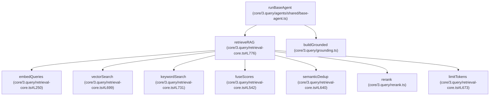

# System Freeze State: Codebase-Grounded Analysis

This document represents the absolute truth of the system configuration and execution flows as verified directly from codebase inspection of implementation files (`*.ts` and `*.js`). All findings below are mapped directly to their source files and functions.

---

## SECTION 1 — HTF-MACRO ENTRYPOINT

The call stack tracing the entry point of the **HTF-Macro-Agent** is as follows:

1. **Client/Server Request Handling**
   * **File**: [server.js](file:///D:/10.%20ict-scholar-agents-V1/server.js#L155) and [server.js](file:///D:/10.%20ict-scholar-agents-V1/server.js#L222) (auto-triggers or processes via endpoint `/run-analysis` or `/run-system`)
   * **Function**: Express request handlers (auto-triggering or direct calling of `runAnalysis` or `runSystem`)

2. **System Analysis Facade**
   * **File**: [app/facades/run-analysis.ts](file:///D:/10.%20ict-scholar-agents-V1/app/facades/run-analysis.ts#L152)
   * **Function**: `runAnalysis`
   * **Call order**: `runAnalysis` reads inputs, establishes NYPD session context, loads historical state, and calls `runSystem`.

3. **System Runner Pipeline Orchestrator**
   * **File**: [core/4.output/run-system.ts](file:///D:/10.%20ict-scholar-agents-V1/core/4.output/run-system.ts#L493)
   * **Function**: `runSystem`
   * **Call order**: `runSystem` runs the analysis steps sequentially: `runTimeOrchestrator` $\rightarrow$ `runHTFOrchestrator` $\rightarrow$ `runITFOrchestrator` $\rightarrow$ `runLTFOrchestrator` $\rightarrow$ `runMasterOrchestrator`.

4. **HTF Timeframe Layer Orchestrator**
   * **File**: [core/3.query/orchestrators/htf-orchestrator.ts](file:///D:/10.%20ict-scholar-agents-V1/core/3.query/orchestrators/htf-orchestrator.ts#L290)
   * **Function**: `runHTFOrchestrator`
   * **Call order**: `runHTFOrchestrator` safely executes downstream timeframe agents (`htfStructureAgent`, `htfMacroAgent`, `htfLiquidityAgent`, and `htfPDArrayAgent`) in parallel using `runSafeAgent`.

5. **HTF-Macro-Agent Function Execution**
   * **File**: [core/3.query/agents/htf/htf-macro-agent.ts](file:///D:/10.%20ict-scholar-agents-V1/core/3.query/agents/htf/htf-macro-agent.ts#L18)
   * **Function**: `htfMacroAgent`

---

## SECTION 2 — INPUT CONTRACT

The input structure for the HTF-Macro-Agent is defined as follows:

* **Source File**: [shared/contracts/htf/macro.ts](file:///D:/10.%20ict-scholar-agents-V1/shared/contracts/htf/macro.ts#L18-L23)
* **Shape**:
  ```typescript
  export interface HTFMacroInput {
    eurusd: { d: string | null; w?: string | null; m?: string | null };
    dxy?: { d?: string | null; w?: string | null; m?: string | null };
    us10y?: { d?: string | null; w?: string | null; m?: string | null };
    us20y?: { d?: string | null; w?: string | null; m?: string | null };
  }
  ```
* **Required Fields**:
  * Root field `eurusd` is required.
  * The nested field `eurusd.d` is effectively required for agent execution. If `input?.eurusd?.d` is missing or null, the agent returns the fallback state (see [core/3.query/agents/htf/htf-macro-agent.ts#L25](file:///D:/10.%20ict-scholar-agents-V1/core/3.query/agents/htf/htf-macro-agent.ts#L25)).
* **Optional Fields**:
  * Root fields `dxy`, `us10y`, and `us20y` are optional.
  * Nested fields `w` and `m` inside `eurusd` are optional.
  * Nested fields `d`, `w`, and `m` inside `dxy`, `us10y`, and `us20y` are optional.

---

## SECTION 3 — OUTPUT CONTRACT

The output structure returned by the HTF-Macro-Agent is defined as follows:

* **Source File**: [shared/contracts/htf/macro.ts](file:///D:/10.%20ict-scholar-agents-V1/shared/contracts/htf/macro.ts#L25-L28) and [shared/contracts/common/base-agent.ts](file:///D:/10.%20ict-scholar-agents-V1/shared/contracts/common/base-agent.ts#L3-L7)
* **Shape**:
  ```typescript
  export interface HTFMacroOutput extends BaseAgentOutput {
    facts: VisionFact[];
    _debug?: BaseDebugInfo;
  }
  
  // BaseAgentOutput inherited properties:
  export interface BaseAgentOutput {
    confidence: number; // exported via import from pmso
    reasoning: string;
    dominant_factors?: string[];
  }
  ```
* **Fallback Output Shape**:
  ```typescript
  const fallback: HTFMacroOutput = {
    confidence: 0.1,
    facts: [],
    reasoning: "No valid macro data"
  };
  ```
  * **Source File**: [core/3.query/agents/htf/htf-macro-agent.ts](file:///D:/10.%20ict-scholar-agents-V1/core/3.query/agents/htf/htf-macro-agent.ts#L19-L23)

---

## SECTION 4 — QUERY PIPELINE

The execution path of queries when using `runBaseAgent` runs as follows:

1. **`runBaseAgent` Initialization**
   * **File**: [core/3.query/agents/shared/base-agent.ts](file:///D:/10.%20ict-scholar-agents-V1/core/3.query/agents/shared/base-agent.ts#L337)
   * **Function**: `runBaseAgent`
   * **Call order**: 1

2. **Load Pipeline Concepts**
   * **File**: [core/3.query/agents/shared/base-agent.ts](file:///D:/10.%20ict-scholar-agents-V1/core/3.query/agents/shared/base-agent.ts#L357-L358)
   * **Functions**: `loadPipeline` and `extractConcepts` (from [core/3.query/pipeline-processor.ts](file:///D:/10.%20ict-scholar-agents-V1/core/3.query/pipeline-processor.ts))
   * **Call order**: 2

3. **Query Builder Baseline Initialization**
   * **File**: [core/3.query/agents/shared/base-agent.ts](file:///D:/10.%20ict-scholar-agents-V1/core/3.query/agents/shared/base-agent.ts#L364)
   * **Function**: `buildQueries` (from [core/3.query/query-builder.ts](file:///D:/10.%20ict-scholar-agents-V1/core/3.query/query-builder.ts#L37))
   * **Call order**: 3 (invoked with `{ skipFinalize: !!config.visionPrompt }`)

4. **Vision-First Execution (Lane Merger)**
   * If `visionPrompt` is provided (e.g., in HTF Macro Agent):
     * Calls Gemini Vision LLM with image attachments to produce `visionSummary`.
     * Extracts Lane 1 ontology concepts: `extractConceptsFromVision(visionSummary)` (calls [ontologyLoader.findConceptsInText](file:///D:/10.%20ict-scholar-agents-V1/core/3.query/ontology/loader.ts#L116)). Builds queries: `buildQueries(visionConcepts, knowledgeMap)` (calls [core/3.query/query-builder.ts#L37](file:///D:/10.%20ict-scholar-agents-V1/core/3.query/query-builder.ts#L37)).
     * Extracts Lane 2 vision facts: `visionFactExtractor.extractFacts(visionSummary)` and maps them to queries: `visionFactExtractor.factsToQueries(visionFacts)` (from [core/3.query/vision-signal-extractor.ts](file:///D:/10.%20ict-scholar-agents-V1/core/3.query/vision-signal-extractor.ts#L194)).
     * Merges all three lanes by calling `finalizeWeightedQueries` (from [core/3.query/query-builder.ts#L308](file:///D:/10.%20ict-scholar-agents-V1/core/3.query/query-builder.ts#L308)) at [core/3.query/agents/shared/base-agent.ts#L422](file:///D:/10.%20ict-scholar-agents-V1/core/3.query/agents/shared/base-agent.ts#L422).
   * **Call order**: 4

5. **Generate Embeddings**
   * **File**: [core/3.query/agents/shared/base-agent.ts](file:///D:/10.%20ict-scholar-agents-V1/core/3.query/agents/shared/base-agent.ts#L484)
   * **Function**: `embedQueries` (from [core/3.query/retrieval-core.ts](file:///D:/10.%20ict-scholar-agents-V1/core/3.query/retrieval-core.ts#L250))
   * **Call order**: 5

6. **Retrieval Core (RAG)**
   * **File**: [core/3.query/agents/shared/base-agent.ts](file:///D:/10.%20ict-scholar-agents-V1/core/3.query/agents/shared/base-agent.ts#L549)
   * **Function**: `retrieveRAG` (from [core/3.query/retrieval-core.ts](file:///D:/10.%20ict-scholar-agents-V1/core/3.query/retrieval-core.ts#L776))
   * **Call order**: 6

---

## SECTION 5 — ACTIVE QUERY SOURCES

The status of the query sources in the query generation logic is documented below:

1. **Anchor queries**
   * **Status**: **PRESENT IN CODE**
   * **File/Function**: [core/3.query/query-builder.ts](file:///D:/10.%20ict-scholar-agents-V1/core/3.query/query-builder.ts#L130) inside `buildQueries`

2. **Canonical expansion**
   * **Status**: **PRESENT IN CODE**
   * **File/Function**: [core/3.query/query-builder.ts](file:///D:/10.%20ict-scholar-agents-V1/core/3.query/query-builder.ts#L137) inside `buildQueries`

3. **Alias expansion**
   * **Status**: **NOT PRESENT IN CODE** (Disabled/Commented Out)
   * **File/Function**: [core/3.query/query-builder.ts](file:///D:/10.%20ict-scholar-agents-V1/core/3.query/query-builder.ts#L155-L175) inside `buildQueries`

4. **Knowledge Map Templates**
   * **Status**: **NOT PRESENT IN CODE** (Hardcoded to `const ENABLE_KM_TEMPLATES = false;`)
   * **File/Function**: [core/3.query/query-builder.ts](file:///D:/10.%20ict-scholar-agents-V1/core/3.query/query-builder.ts#L44) and [core/3.query/query-builder.ts#L90](file:///D:/10.%20ict-scholar-agents-V1/core/3.query/query-builder.ts#L90) inside `buildQueries`

5. **Scenario expansion**
   * **Status**: **PRESENT IN CODE**
   * **File/Function**: [core/3.query/query-builder.ts](file:///D:/10.%20ict-scholar-agents-V1/core/3.query/query-builder.ts#L188-L222) inside `buildQueries`

6. **Relational expansion**
   * **Status**: **PRESENT IN CODE**
   * **File/Function**: [core/3.query/query-builder.ts](file:///D:/10.%20ict-scholar-agents-V1/core/3.query/query-builder.ts#L225-L258) inside `buildQueries`

7. **Vision concepts**
   * **Status**: **PRESENT IN CODE**
   * **File/Function**: [core/3.query/agents/shared/base-agent.ts](file:///D:/10.%20ict-scholar-agents-V1/core/3.query/agents/shared/base-agent.ts#L400-L403) inside `runBaseAgent` (calls `extractConceptsFromVision` $\rightarrow$ `buildQueries`)

8. **Vision facts**
   * **Status**: **PRESENT IN CODE**
   * **File/Function**: [core/3.query/agents/shared/base-agent.ts](file:///D:/10.%20ict-scholar-agents-V1/core/3.query/agents/shared/base-agent.ts#L412-L418) inside `runBaseAgent` (calls `visionFactExtractor.extractFacts` $\rightarrow$ `factsToQueries`)

---

## SECTION 6 — ONTOLOGY USAGE

The loading and consumption patterns of the domain ontology are documented below:

* **Where Loaded**:
  * **File**: [core/3.query/ontology/loader.ts](file:///D:/10.%20ict-scholar-agents-V1/core/3.query/ontology/loader.ts#L137) and [core/5.eval/runner.ts](file:///D:/10.%20ict-scholar-agents-V1/core/5.eval/runner.ts#L21)
  * **Function**: `ontologyLoader.load()` is called immediately on module initialization in `loader.ts`, and optionally loaded with `candidateMode` parameter in the evaluation `runner.ts`.

* **Where Called / Consumed**:
  1. **Canonical Lookup (`getCanonical`)**:
     * **File**: [core/3.query/query-builder.ts](file:///D:/10.%20ict-scholar-agents-V1/core/3.query/query-builder.ts#L137)
     * **Function**: Called inside `buildQueries` to map concepts to their canonical equivalents.
     * **File**: [core/3.query/ontology/scorer.ts](file:///D:/10.%20ict-scholar-agents-V1/core/3.query/ontology/scorer.ts#L30)
     * **Function**: Called inside `calculateOntologyBonus` to retrieve the query's canonical name.
  2. **Surface Term Lookup (`findConceptsInText`)**:
     * **File**: [core/3.query/vision-grounded-knowledge.ts](file:///D:/10.%20ict-scholar-agents-V1/core/3.query/vision-grounded-knowledge.ts#L67)
     * **Function**: Called inside `extractConceptsFromVision` to parse ontology-defined terms from vision summary text.
  3. **Annotation Lookup (`getAnnotation`)**:
     * **File**: [core/3.query/ontology/scorer.ts](file:///D:/10.%20ict-scholar-agents-V1/core/3.query/ontology/scorer.ts#L15)
     * **Function**: Called inside `calculateOntologyBonus` to load chunk concepts and annotations.
     * **File**: [core/3.query/rerank.ts](file:///D:/10.%20ict-scholar-agents-V1/core/3.query/rerank.ts#L163)
     * **Function**: Called inside `rerank` for scoring chunk-concept alignments.

---

## SECTION 7 — LANE ARCHITECTURE

The query lanes used inside the vision-first execution path of `runBaseAgent` are structured as follows:

* **Lane 0 (Baseline Concepts)**:
  * **Source**: Extracted step concepts from the pipeline config.
  * **File/Function**: [core/3.query/agents/shared/base-agent.ts](file:///D:/10.%20ict-scholar-agents-V1/core/3.query/agents/shared/base-agent.ts#L397) inside `runBaseAgent` (defined via `baseQueries`).
* **Lane 1 (Vision Ontology Concepts)**:
  * **Source**: Ontology concepts matched in the raw vision summary text.
  * **File/Function**: [core/3.query/agents/shared/base-agent.ts](file:///D:/10.%20ict-scholar-agents-V1/core/3.query/agents/shared/base-agent.ts#L400-L403) inside `runBaseAgent` (calls `extractConceptsFromVision` $\rightarrow$ `buildQueries`).
* **Lane 2 (Vision Raw Observations)**:
  * **Source**: Direct factual statements extracted from the vision summary.
  * **File/Function**: [core/3.query/agents/shared/base-agent.ts](file:///D:/10.%20ict-scholar-agents-V1/core/3.query/agents/shared/base-agent.ts#L412-L418) inside `runBaseAgent` (calls `visionFactExtractor.extractFacts` $\rightarrow$ `factsToQueries` and sets weight to `0.9`).
* **Where Merged**:
  * **File/Function**: [core/3.query/agents/shared/base-agent.ts](file:///D:/10.%20ict-scholar-agents-V1/core/3.query/agents/shared/base-agent.ts#L421-L425) inside `runBaseAgent`. It imports and calls `finalizeWeightedQueries(allLanes, mainConcept)` to merge the three lanes at the query list level, returning a deduplicated list capped at 15 queries.

---

## SECTION 8 — RETRIEVAL FLOW

Below is the call graph tracing the execution of `retrieveRAG` through search, scoring, deduplication, and reranking:



### Trace Details:
1. **`retrieveRAG`** is called with the queries and embeddings.
2. **`embedQueries`** batches and resolves embeddings from the Gemini embedding model API.
3. **`vectorSearch`** performs cosine similarity (via `topKSimilar`) over loaded `ChunkVector` files.
4. **`keywordSearch`** computes BM25 token frequencies over loaded `Chunk` files.
5. **`fuseScores`** weights and sums Vector score ($70\%$) and BM25 score ($15\%$) and applies various modifiers (concept bonus, ontology bonus, hierarchy bonus, relational bonus, scenario bonus, and PMSO bonus).
6. **`semanticDedup`** removes duplicate hits using semantic similarity ($> 90\%$ cosine similarity).
7. **Threshold Filtering** discards chunks with scores $< 30\%$ of the maximum score.
8. **`rerank`** re-scores remaining chunks using cross-attention or thesis-based relevance logic.
9. **`limitTokens`** truncates the retrieved results to stay under a 5000-token limit.
10. **`buildGrounded`** (called in `base-agent.ts` at line 610) formats the final selected chunks into the markdown text context sent to the agent prompt.

---

## SECTION 9 — ATTRIBUTION FLOW

Attribution tracking processes telemetry to determine the source lane that retrieved each document chunk:

1. **Attribution Initialization / Reset**
   * **File**: [core/3.query/agents/shared/base-agent.ts](file:///D:/10.%20ict-scholar-agents-V1/core/3.query/agents/shared/base-agent.ts#L487)
   * **Function**: `attributionTracker.reset()` (resets all internal Maps in the tracker class).

2. **Lanes Registration**
   * **File**: [core/3.query/agents/shared/base-agent.ts](file:///D:/10.%20ict-scholar-agents-V1/core/3.query/agents/shared/base-agent.ts#L519) and [core/3.query/agents/shared/base-agent.ts#L526](file:///D:/10.%20ict-scholar-agents-V1/core/3.query/agents/shared/base-agent.ts#L526)
   * **Function**: `attributionTracker.registerLanes(laneRegistrations)` maps queries to their corresponding lane labels (`lane0`, `lane1`, or `lane2`).

3. **Query Attribution Tracking**
   * **File**: [core/3.query/retrieval-core.ts](file:///D:/10.%20ict-scholar-agents-V1/core/3.query/retrieval-core.ts#L725) (Vector search) and [core/3.query/retrieval-core.ts#L766](file:///D:/10.%20ict-scholar-agents-V1/core/3.query/retrieval-core.ts#L766) (BM25 keyword search)
   * **Function**: `attributionTracker.trackQueryChunks(query, chunkIds)` logs that a query was responsible for returning a specific set of chunk IDs.

4. **Attribution Metric Computation**
   * **File**: [core/3.query/agents/shared/base-agent.ts](file:///D:/10.%20ict-scholar-agents-V1/core/3.query/agents/shared/base-agent.ts#L578)
   * **Function**: `attributionTracker.computeMetrics()` consolidates metrics for each lane (query count, triggered chunks, unique chunks, shared chunks, and Lane 2 hit rates).

---

## SECTION 10 — CURRENT IMPLEMENTATION INVENTORY

| Component | Exists In Code | File |
| :--- | :--- | :--- |
| **Knowledge Map Templates** | **NOT PRESENT IN CODE** (Disabled) | [core/3.query/query-builder.ts](file:///D:/10.%20ict-scholar-agents-V1/core/3.query/query-builder.ts#L44) |
| **Ontology Loader** | **PRESENT IN CODE** | [core/3.query/ontology/loader.ts](file:///D:/10.%20ict-scholar-agents-V1/core/3.query/ontology/loader.ts#L9) |
| **Scenario Expansion** | **PRESENT IN CODE** | [core/3.query/query-builder.ts](file:///D:/10.%20ict-scholar-agents-V1/core/3.query/query-builder.ts#L188) |
| **Relational Expansion** | **PRESENT IN CODE** | [core/3.query/query-builder.ts](file:///D:/10.%20ict-scholar-agents-V1/core/3.query/query-builder.ts#L225) |
| **Vision Signal Extractor** | **PRESENT IN CODE** | [core/3.query/vision-signal-extractor.ts](file:///D:/10.%20ict-scholar-agents-V1/core/3.query/vision-signal-extractor.ts#L35) |
| **Attribution Tracker** | **PRESENT IN CODE** | [core/3.query/retrieval-attribution.ts](file:///D:/10.%20ict-scholar-agents-V1/core/3.query/retrieval-attribution.ts#L35) |
| **Query Finalizer** | **PRESENT IN CODE** | [core/3.query/query-builder.ts](file:///D:/10.%20ict-scholar-agents-V1/core/3.query/query-builder.ts#L308) (`finalizeWeightedQueries`) |
