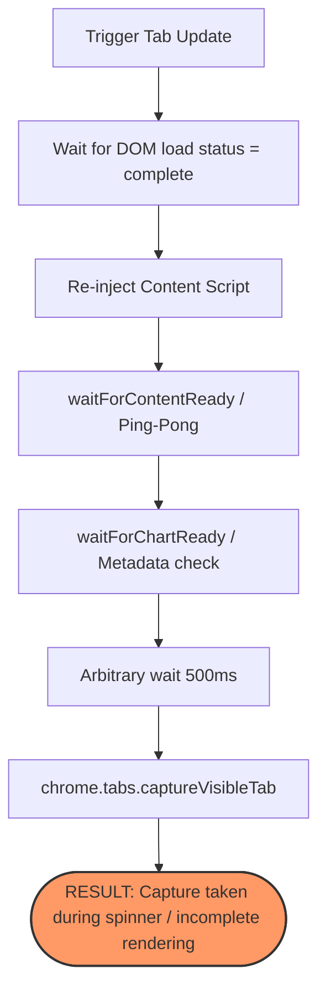
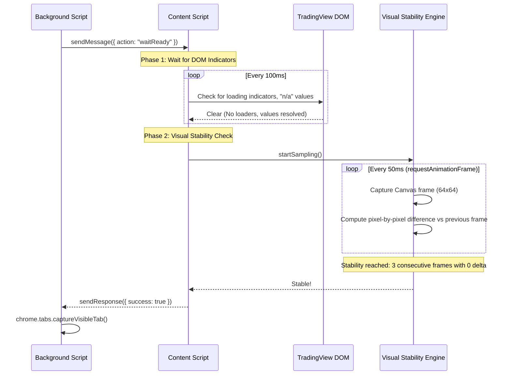

# Capture Readiness Architecture Audit

This audit addresses the critical problem of capturing TradingView charts via the extension screenshot pipeline before all components (candles, price axis labels, indicators, and drawing objects) have fully loaded and rendered. 

Currently, the extension relies on arbitrary timeouts (`wait(500)`, `wait(1000)`) and simple DOM presence checks (`waitForChartReady`), which lead to blank or partially rendered chart captures under CPU throttling, network latency, or slow layout loads.

---

## 1. Current Failure Path Analysis

The current implementation in [background.js](file:///d:/10.%20ict-scholar-agents-V1/extension/background.js) and [content.js](file:///d:/10.%20ict-scholar-agents-V1/extension/content.js) contains several vulnerabilities that lead to capture failures:



### Key Failure Points:
1. **The Metadata Race Condition**: `waitForChartReady` passes as soon as `getMetadata()` returns a non-`UNKNOWN` symbol and timeframe. However, the DOM header elements displaying the symbol are updated *instantly* upon URL state changes, long before the WebSocket connection resolves and the actual candles or indicators are painted onto the canvas.
2. **Asynchronous Indicator Calculation**: TradingView's indicator engines (Pine Script runner) compute indicators asynchronously in a separate worker thread or execution queue. Even if candle data is visible, complex indicators (e.g., SMT, multi-timeframe overlays, custom order blocks) can take several hundred milliseconds to compute and draw.
3. **Lazy-Loaded Drawings**: Saved user drawings (lines, boxes, Fibonacci tools) are retrieved from TradingView's cloud layout database. The REST response for user drawings frequently arrives *after* the initial chart rendering is done, causing drawing canvases to snap into place 500ms–2000ms after the page loading spinner disappears.
4. **Arbitrary Delay Vulnerability**: The `wait(500)` call before capturing is a classic "sleep anti-pattern." It wastes 500ms when the chart is cached and loaded instantly, but fails completely if network congestion or low-power CPU states extend the render time to 1200ms.

---

## 2. TradingView Render Lifecycle Map

To build a deterministic detection system, we must map out how TradingView fetches, processes, and renders data onto the screen:

| Phase | Phase Name | Execution Context | Render state | Indicators of Incomplete State |
| :--- | :--- | :--- | :--- | :--- |
| **1** | **DOM Initialization** | Browser UI Thread | Skeleton UI loaded. Empty chart grids. | `div.layout__area--center` exists but `canvas` is empty or missing. Loading overlay is visible. |
| **2** | **Symbol & Data Connection** | WebSocket (`wss://data.tradingview.com/...`) | Spinners active on pane titles. Chart shows previous symbol or loading state. | Legend elements contain empty strings, `"..."`, or `"n/a"`. Spinners are present in pane header blocks. |
| **3** | **Series Rendering (Candles)** | HTML5 Canvas (Main Series Layer) | Candle bodies are computed and painted. Price scale renders axis coordinates. | Main canvas is blank or only contains gridlines. Price scale contains no price labels. |
| **4** | **Indicator Computation** | Web Worker / JS Engine | Pine Script executions run. Overlay and sub-pane canvases are painted. | Indicator legend status text is grayed out, shows `"n/a"`, or shows zero values. Sub-pane canvases are blank. |
| **5** | **Drawing Database Sync** | HTTP REST & Layout Engine | Drawing JSON objects retrieved and mapped to chart coordinates. | Cloud sync icon is spinning. Drawing canvas overlay contains zero drawing paths despite existing user drawings. |
| **6** | **Frame Buffer Stabilization** | WebGL / Canvas 2D Context | No new draw commands submitted. Frame-to-frame pixel delta reaches absolute zero. | Sequential frames show coordinate changes, scroll animation, or snapping offsets. |

---

## 3. Detection Strategy Ranking

We evaluated four strategies to determine chart capture readiness. The table below ranks them from most to least recommended:

| Rank | Strategy Name | Mechanics | Pros | Cons |
| :---: | :--- | :--- | :--- | :--- |
| **1** | **Visual Stability Engine (Recommended)** | Copy target canvas layers onto a tiny offscreen buffer (e.g., 64x64) and check pixel equality across sequential `requestAnimationFrame` ticks. | **100% deterministic.** Captures only when visual changes completely cease. No dependency on TV internals. | Higher CPU consumption during the sampling loop (mitigated by sampling at 50ms intervals). |
| **2** | **DOM Legend & State Contract** | Poll the chart legend DOM nodes (e.g., `div.legend-item`, `.value-JQZ0HKD4`) and assert that no element contains `"..."`, `"n/a"`, or loading spinners. | Lightweight. Highly accurate for identifying data load completion. | Vulnerable to TradingView obfuscated class name changes (needs periodic selector updates). |
| **3** | **Canvas Context Proxying** | Intercept `CanvasRenderingContext2D.prototype.drawImage` / `stroke` to count render operations. | Detects the exact moment drawing commands stop. | Complex to execute in Chrome extensions due to sandbox context isolation (`window` vs `content script`). |
| **4** | **Pixel-Diff Tab Capture** | Background script captures the tab at 100ms intervals and runs image-diff comparisons. | Requires zero code execution inside the page context. | Heavy extension message passing. High overhead due to repeated base64 image capture calls. |

---

## 4. Recommended Production Design: Capture Readiness Contract

The recommended solution is a hybrid **DOM State Guard + Visual Stability Engine**. It performs two sequential checks:
1. **DOM State Check**: Resolves when data loading indicators and `"n/a"` strings are absent.
2. **Visual Stability Check**: Resolves when canvas rendering becomes stable (zero pixel change for a consecutive period).



### The Visual Stability Engine Algorithm:
To check if the chart is stable without expensive CPU overhead:
1. Find all `<canvas>` elements inside the chart container.
2. Draw them sequentially onto a single small offscreen canvas (e.g. 64x64 pixels).
3. Extract the `ImageData` buffer from the offscreen canvas.
4. Calculate a fast hash or compare pixel byte values against the previous sample.
5. If the comparison has a 0-pixel delta for 3 consecutive samples (spaced 50ms apart), the chart is declared **stable**.

---

## 5. Exact Code Locations & Implementations

### A. Modifications to [content.js](file:///d:/10.%20ict-scholar-agents-V1/extension/content.js)

Add the helper class `VisualStabilityGuard` and update the message listener to handle the `'waitReady'` action.

```javascript
/**
 * VisualStabilityGuard
 * Analyzes visual stability of TradingView canvas elements
 */
class VisualStabilityGuard {
  constructor(targetElement, sampleIntervalMs = 50, requiredStableFrames = 3) {
    this.targetElement = targetElement;
    this.sampleIntervalMs = sampleIntervalMs;
    this.requiredStableFrames = requiredStableFrames;
    this.offscreenCanvas = document.createElement('canvas');
    this.offscreenCanvas.width = 64;
    this.offscreenCanvas.height = 64;
    this.offscreenCtx = this.offscreenCanvas.getContext('2d');
  }

  // Captures all active visible canvases into a small offscreen state
  captureVisualState() {
    const canvases = this.targetElement.querySelectorAll('canvas');
    if (canvases.length === 0) return null;

    this.offscreenCtx.clearRect(0, 0, 64, 64);
    
    // Scale and layer all canvases onto our 64x64 stability matrix
    canvases.forEach(canvas => {
      if (canvas.width > 0 && canvas.height > 0) {
        this.offscreenCtx.drawImage(canvas, 0, 0, 64, 64);
      }
    });

    return this.offscreenCtx.getImageData(0, 0, 64, 64).data;
  }

  // Deterministically awaits stability without using setTimeout/sleep loops
  async awaitStability(timeoutMs = 10000) {
    return new Promise((resolve, reject) => {
      const startTime = Date.now();
      let stableFramesCount = 0;
      let lastPixelBuffer = null;

      const checkStability = () => {
        if (Date.now() - startTime > timeoutMs) {
          console.warn("[Stability] Timeout waiting for stability, resolving anyway.");
          resolve(false);
          return;
        }

        const currentPixelBuffer = this.captureVisualState();
        if (!currentPixelBuffer) {
          requestAnimationFrame(() => setTimeout(checkStability, this.sampleIntervalMs));
          return;
        }

        if (lastPixelBuffer) {
          let hasChanged = false;
          // Simple fast pixel-by-pixel byte comparison
          for (let i = 0; i < currentPixelBuffer.length; i += 4) {
            // Compare RGBA values
            if (
              currentPixelBuffer[i] !== lastPixelBuffer[i] ||
              currentPixelBuffer[i+1] !== lastPixelBuffer[i+1] ||
              currentPixelBuffer[i+2] !== lastPixelBuffer[i+2] ||
              currentPixelBuffer[i+3] !== lastPixelBuffer[i+3]
            ) {
              hasChanged = true;
              break;
            }
          }

          if (!hasChanged) {
            stableFramesCount++;
          } else {
            stableFramesCount = 0; // Reset counter on any layout/candle change
          }
        }

        lastPixelBuffer = currentPixelBuffer;

        if (stableFramesCount >= this.requiredStableFrames) {
          resolve(true);
        } else {
          requestAnimationFrame(() => setTimeout(checkStability, this.sampleIntervalMs));
        }
      };

      checkStability();
    });
  }
}

// DOM State Checker
async function checkDOMReadyState(timeoutMs = 10000) {
  const startTime = Date.now();
  return new Promise((resolve) => {
    const check = () => {
      if (Date.now() - startTime > timeoutMs) {
        console.warn("[DOM Ready] Timeout waiting for DOM values, resolving.");
        resolve(false);
        return;
      }

      // 1. Check for loading indicators
      const loadingIndicator = document.querySelector('[class*="loadingIndicator"], [class*="spinner"]');
      if (loadingIndicator && window.getComputedStyle(loadingIndicator).display !== 'none') {
        setTimeout(check, 100);
        return;
      }

      // 2. Check for legend loading placeholders (like "n/a", "Loading...", empty spans)
      const legendValues = Array.from(document.querySelectorAll('[class*="legend"] [class*="value"]'));
      const stillLoading = legendValues.some(el => {
        const text = el.textContent.trim();
        return text === 'n/a' || text === '...' || text.toLowerCase().includes('loading');
      });

      if (stillLoading) {
        setTimeout(check, 100);
      } else {
        resolve(true);
      }
    };
    check();
  });
}
```

#### Message Listener Integration in `content.js`:
Modify the `chrome.runtime.onMessage.addListener` handler:

```javascript
chrome.runtime.onMessage.addListener((request, sender, sendResponse) => {
  // ... existing ping, getMetadata, and getChartBox checks ...

  if (request.action === 'waitForCaptureReadiness') {
    (async () => {
      console.log('[Capture readiness] Beginning stabilization checks...');
      
      // Phase 1: Wait for DOM loading indicators and data legend placeholders to clear
      await checkDOMReadyState(8000);

      // Phase 2: Wait for visual stabilization (all canvas draws completed)
      const chartArea = document.querySelector('.chart-container-border') || 
                        document.querySelector('.layout__area--center') ||
                        document.body;
      const guard = new VisualStabilityGuard(chartArea, 50, 3);
      const isStable = await guard.awaitStability(5000);

      console.log(`[Capture readiness] Finished. Stable status: ${isStable}`);
      sendResponse({ ready: true, stable: isStable });
    })();
    return true; // Keep message channel open asynchronously
  }
});
```

---

### B. Modifications to [background.js](file:///d:/10.%20ict-scholar-agents-V1/extension/background.js)

Update the pipeline sequence inside `captureMultiSymbolPipeline` to request deterministic stabilization rather than calling `wait(500)`.

#### Before:
```javascript
            await chrome.tabs.update(currentTabId, { active: true });
            const currentTab = await chrome.tabs.get(currentTabId);
            await chrome.windows.update(currentTab.windowId, { focused: true });
            await wait(500);

            const captureStartTime = Date.now();
            const fullDataUrl = await captureTab();
```

#### After:
```javascript
            await chrome.tabs.update(currentTabId, { active: true });
            const currentTab = await chrome.tabs.get(currentTabId);
            await chrome.windows.update(currentTab.windowId, { focused: true });

            // CRITICAL: Deterministically check for capture readiness instead of wait(500)
            log({ stage: "STABILIZATION_START", message: "Awaiting visual stability contract..." });
            try {
              await sendMessageWithTimeout(currentTabId, { action: 'waitForCaptureReadiness' }, 15000);
              log({ stage: "STABILIZATION_COMPLETE", message: "Stability contract verified." });
            } catch (e) {
              log({ stage: "STABILIZATION_TIMEOUT", message: "Stabilization timed out, proceeding anyway", level: "WARN" });
            }

            const captureStartTime = Date.now();
            const fullDataUrl = await captureTab();
```

---

## 6. Risk Analysis & Mitigations

### 1. Canvas Tainting / CORS Blocks (High Risk)
*   **Risk**: If TradingView loads images from outside domains onto its canvas without CORS approval, calling `getImageData()` will throw a SecurityError, breaking the visual stability checker.
*   **Mitigation**: TradingView canvases are typically locally drawn vectors and do not taint the canvas context. However, the code handles this by catching exceptions inside `captureVisualState()`. If a context is tainted, it falls back to a DOM-only status resolve + a safe timeout.

### 2. Live Market Ticks Interrupting Stability (Medium Risk)
*   **Risk**: If the market is highly volatile (e.g. during major news releases), ticks update the canvas coordinate buffer constantly. The visual check might never see 0-pixel delta frames, causing a timeout.
*   **Mitigation**: The VisualStabilityGuard is configured with a 5-second max timeout. If a fast-moving market prevents stability from settling, it falls back gracefully by logging a warning and returning `false` (allowing capture to proceed with the best available frame).

### 3. DOM Class Name Refactoring (Low Risk)
*   **Risk**: TradingView modifies class names (e.g., changing `.value-JQZ0HKD4` or indicator spinner classes) during updates, which can break target selectors.
*   **Mitigation**: The DOM check relies on robust partial match attributes (like `[class*="legend"]` and `[class*="spinner"]`) instead of hardcoded obfuscated classes.

### 4. Background Tab Inactive Throttling (Medium Risk)
*   **Risk**: Chromium aggressively throttles `requestAnimationFrame` and `setTimeout` loops in inactive/background tabs, causing stability engines to hang.
*   **Mitigation**: The background script forces the target tab to become active (`chrome.tabs.update(currentTabId, { active: true })`) and focuses the browser window *before* requesting readiness checks, ensuring the browser executes layout loops at full speed.
