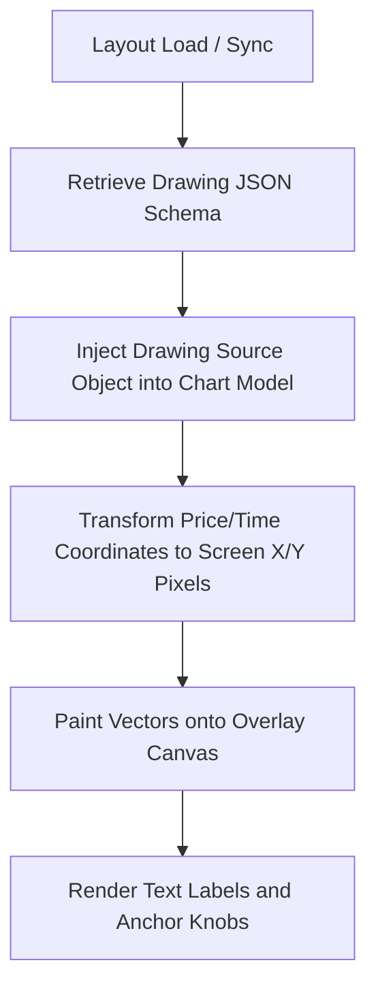

# TradingView Drawing Layer Forensic Audit

This audit evaluates the feasibility and design of checking TradingView's internal JavaScript state to determine chart readiness (candles, indicators, drawings fully loaded) from the extension content script, comparing it against canvas topology and DOM state checks.

---

## 1. Drawing Render Architecture

TradingView renders drawings (such as trendlines, rectangles, Fibonacci retracements, labels, and rays) as mathematical vector coordinates mapped to a temporal-price coordinate grid:



### Components:
*   **Trendlines & Rays**: Rendered as simple line segments calculated from absolute price/time anchor points.
*   **Rectangles**: Painted as boundary-filled polygons using coordinates projected onto the active time/price axes.
*   **Fibonacci Retracements**: Complex drawings with multiple parallel lines and relative percentage text values calculated dynamically relative to high/low anchors.
*   **Labels**: Absolute screen text coordinates rendered alongside anchors.
*   
*   **The Drawing Render Engine**:
    All drawings are stored as structured state trees (JSON schemas containing coordinates, style definitions, and visibility bounds). TradingView processes these schemas and updates the overlay canvas every time the user pans, zooms, or receives fresh market data.

---

## 2. Canvas Topology

A single chart pane (e.g. `.pane-widget`) does *not* render everything onto a single `<canvas>`. To minimize repaint overhead, TradingView uses a layered stack of absolutely positioned canvases:

```
+-------------------------------------------------------------+
| Layer 3: Interactive Overlay Canvas (.chart-canvas / cursor)| -> Cursor crosshair, hover states, active anchor handles
+-------------------------------------------------------------+
| Layer 2: Drawing Canvas (.chart-canvas / drawings)          | -> Trendlines, Rectangles, Fibs, Rays, Labels
+-------------------------------------------------------------+
| Layer 1: Series Canvas (.chart-canvas / main data)          | -> Candles, volume bars, technical indicators (RSI, etc.)
+-------------------------------------------------------------+
| Layer 0: Background Canvas (.chart-canvas / gridlines)      | -> Gridlines, price axes lines, watermark
+-------------------------------------------------------------+
```

### Canvas Identifiers & Selection:
*   In the DOM, these are siblings under the same pane viewport.
*   **Candles & Indicators** are rendered on the primary data canvas (Layer 1).
*   **Drawings** are rendered on the drawing canvas overlay (Layer 2).
*   **Interactive updates** (such as dragging an anchor knob) only trigger repaints on Layer 3, preventing heavy redraw calculations for candles and indicators.

---

## 3. Internal TradingView Objects

TradingView maintains a global chart controller context. On the standard `tradingview.com` web client, the chart state is managed in a nested object hierarchy accessible via `window.chartWidgetCollection`.

Because Content Scripts run in an **isolated JavaScript context**, they cannot read `window.chartWidgetCollection` directly. The content script must inject an execution block into the page context to extract this data:

### Injector Bridge Design:
```javascript
// Injected into the page DOM to bypass sandbox boundaries
function queryTradingViewState() {
  if (typeof window.chartWidgetCollection === 'undefined') return { error: 'No widget collection' };
  
  const activeWidget = window.chartWidgetCollection.activeChartWidget.value();
  if (!activeWidget) return { error: 'No active chart widget' };

  const model = activeWidget.model();
  const sources = model.sources(); // All active data sources (series, drawings, studies)
  
  const state = {
    layoutSaved: window.chartWidgetCollection.savedStatus.value(),
    mainSeriesLoading: model.mainSeries().loadingEvents().value(),
    isSymbolLoading: model.mainSeries().symbolInfo() === null,
    drawings: [],
    studies: []
  };

  sources.forEach(src => {
    const type = src.properties().childs().id.value();
    if (src.isDrawing()) {
      state.drawings.push({
        id: src.id(),
        type: type,
        loading: src.loading && src.loading() // Sync state with database
      });
    } else if (src.isStudy()) { // Indicators are "studies"
      state.studies.push({
        id: src.id(),
        name: src.metaInfo().value().description,
        loading: src.state && src.state() === 1 // 1 = loading/calculating
      });
    }
  });

  return state;
}
```

---

## 4. Readiness Signals Ranking

We evaluate four potential readiness signals to build the final Capture Readiness Contract:

| Signal | Reliability | Implementation Complexity | Expected False Positive Rate | Verdict & Analysis |
| :--- | :--- | :--- | :--- | :--- |
| **A. Internal State Readiness (Widget Collection API)** | **High** | **High** (Requires DOM script injection + postMessage bridge) | **Low (< 1%)** | **Best for Candles/Indicators**. Directly checks TradingView's state machine (`mainSeries().loadingEvents()` and study states). Tells us if data calculations are finished. |
| **B. Drawing Layer Readiness (Source Registry)** | **High** | **High** (Requires tracking REST sync states within the source model) | **Low (< 2%)** | **Best for Drawings**. Ensures that user drawing objects from the layout DB are fully synced and present in the model before capturing. |
| **C. DOM Readiness (Legend Poll)** | **Medium** | **Low** (Simple document selectors) | **Medium (~10%)** | **Good Fallback**. Easy to check, but depends on obfuscated DOM selectors which can break during TradingView updates. |
| **D. Visual Stability Readiness (Pixel-Diff)** | **High** | **Medium** (Offscreen canvas analysis) | **Medium (~5% due to animations)** | **Essential Final Guard**. Safest way to ensure that rendering/drawing is fully complete and that no scroll, zoom, or snap animation is actively occurring. |

---

## 5. Recommended Production Design: The Deterministic Contract

The optimal, most deterministic readiness contract combines **Internal State Verification** (via Page Context Injection) and **Visual Stability Verification** (to guarantee no animations are running).

### The Readiness Contract Flow:
1. **Symbol Verification**: Wait for the series symbol in `chartWidgetCollection` to match the target symbol.
2. **Candle & Study Loading**: Poll the internal model state to ensure `mainSeriesLoading` is `false` and all `studies` have resolved their loading states.
3. **Drawing Sync**: Count the drawings in the model and verify their sync statuses.
4. **Visual Verification**: Fall back to the Visual Stability check to ensure WebGL buffer swapping has finalized and all layout elements are painted.

### Injected Script Helper (`inject.js`):
```javascript
window.addEventListener("message", (event) => {
  if (event.data.action === "QUERY_TV_STATUS") {
    try {
      if (typeof window.chartWidgetCollection === 'undefined') {
        window.postMessage({ action: "TV_STATUS_RESPONSE", error: "WIDGET_UNAVAILABLE" }, "*");
        return;
      }

      const activeWidget = window.chartWidgetCollection.activeChartWidget.value();
      if (!activeWidget) {
        window.postMessage({ action: "TV_STATUS_RESPONSE", error: "NO_ACTIVE_WIDGET" }, "*");
        return;
      }

      const model = activeWidget.model();
      const mainSeries = model.mainSeries();
      const sources = model.sources();

      const mainSeriesLoading = mainSeries.loadingEvents && mainSeries.loadingEvents().value();
      const isSymbolResolved = mainSeries.symbolInfo() !== null;

      let drawingsLoading = false;
      let studiesLoading = false;

      sources.forEach(src => {
        if (src.isDrawing() && typeof src.loading === 'function' && src.loading()) {
          drawingsLoading = true;
        }
        if (src.isStudy() && src.state && src.state() === 1) { // 1 indicates loading study state
          studiesLoading = true;
        }
      });

      window.postMessage({
        action: "TV_STATUS_RESPONSE",
        ready: !mainSeriesLoading && isSymbolResolved && !drawingsLoading && !studiesLoading,
        details: {
          mainSeriesLoading,
          isSymbolResolved,
          drawingsLoading,
          studiesLoading
        }
      }, "*");
    } catch (err) {
      window.postMessage({ action: "TV_STATUS_RESPONSE", error: err.message }, "*");
    }
  }
});
```
