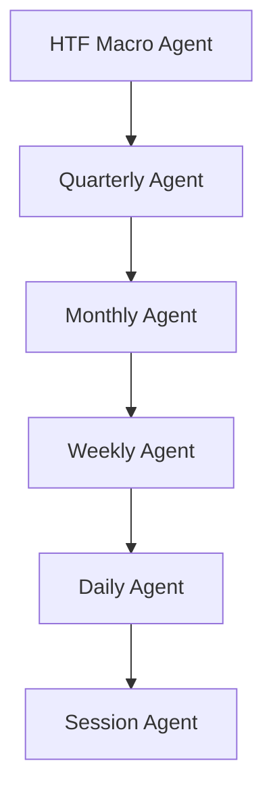

# Semantic Pipeline Trace

This document traces the complete semantic flow for each agent in the multi-agent hierarchy under the **Vision-First** migration framework. It tracks how conceptual inputs from legacy templates, real-time visual observations (Lane 2), and historical grounded data (Lane 0/1) merge to drive the final LLM response.

---

## Agent Hierarchy Semantic Flows

---

### 1. HTF Macro Agent (Run: `1781185262185`)

*   **Input Concepts**: Dollar Index Seasonal Tendency, June-July Rally, Yield Shifts, Correlated Asset Divergence, Inversion FVG, Bearish Order Block.
*   **Generated Queries**:
    *   *Lane 0 (Base)*: None (Directly processed through vision/intermarket facts).
    *   *Lane 1 (Vision Ontology)*: Dollar Index Seasonal Tendency, Inversion Fair Value Gap.
    *   *Lane 2 (Vision Observations)*: `US20Y bullish displacement daily`, `US20Y bearish displacement daily`, `US20Y DXY and US10Y are currently moving in op daily`.
*   **Vision Facts**:
    *   DXY shows bullish displacement across Daily, Weekly, and Monthly candles.
    *   US10Y and US20Y show bearish displacement across Daily, Weekly, and Monthly candles.
    *   Intermarket Divergence: DXY and US10Y/US20Y are moving in opposite directions.
*   **Final Executed Queries**: Bullish/bearish yield displacements, DXY-Yield divergence queries.
*   **Retrieved Chunks**:
    *   [chunk_2627](file:///d:/10.%20ict-scholar-agents-V1/data/rag-debug/1781185262185/HTF-Macro-Agent/08_RESPONSE.json#L240) (DXY Seasonal Tendency)
    *   [chunk_1854](file:///d:/10.%20ict-scholar-agents-V1/data/rag-debug/1781185262185/HTF-Macro-Agent/08_RESPONSE.json#L236) (FVG analysis)
    *   [chunk_1785](file:///d:/10.%20ict-scholar-agents-V1/data/rag-debug/1781185262185/HTF-Macro-Agent/08_RESPONSE.json#L237) (DXY liquidity void)
    *   [chunk_2101](file:///d:/10.%20ict-scholar-agents-V1/data/rag-debug/1781185262185/HTF-Macro-Agent/08_RESPONSE.json#L238) (DXY daily breaker/FVG)
*   **Grounded Chunks**: Principles extracted regarding transposing higher timeframe PD arrays, DXY seasonal peaks, and inversion FVG transitions.
*   **Prompt Context**: Combines DXY bullish displacement + Yield bearish displacement visual facts with historical DXY/Yield RAG chunks.
*   **LLM Reasoning**: Identified divergence (DXY rising, yields falling). Noted that yields fell while DXY made a moderate daily bullish run. Reconciled seasonal DollarIndex tendencies.
*   **Final Output**:
    *   *Facts Array*: Bullet points of active yield drops, dollar pushes, and divergence confirmations.
    *   *System Status*: Confirmed macro-level intermarket divergence.

---

### 2. Quarterly Agent (Run: `1781197702909`)

*   **Input Concepts**: Quarterly Bias, Quarterly Seasonality, Quarterly profile, End-of-Quarter Reversal, NFP Reversal.
*   **Generated Queries**:
    *   *Lane 0 (Base)*: Quarterly Bias, Quarterly Seasonality, Quarterly profile, NFP Reversal.
    *   *Lane 1 (Vision Ontology)*: Quarterly Shift, Dealing Range, IPDA Range, opening range.
    *   *Lane 2 (Vision Observations)*: `On the Weekly chart`, `The start of Q3 2025  on the Weekly char`, `A prominent dealing range can be identif`, `order block`, `bullish FVG`.
*   **Vision Facts**:
    *   Initial dip at start of Q2/Q3 2025 followed by subsequent rally.
    *   Weekly dealing range established: 1.1495 (low) to 1.1804 (high). Current price at 1.1718 is in a premium.
    *   Bullish FVGs and order blocks traded above.
*   **Final Executed Queries**: Premium/discount ranges, quarterly shift cycles, and weekly order blocks.
*   **Retrieved Chunks**:
    *   [chunk_1827](file:///d:/10.%20ict-scholar-agents-V1/data/rag-debug/1781197702909/Quarterly-Agent/08_RESPONSE.json#L237) (NASDAQ weekly FVG and Fibonacci range)
    *   [chunk_1854](file:///d:/10.%20ict-scholar-agents-V1/data/rag-debug/1781197702909/Quarterly-Agent/08_RESPONSE.json#L238) (FVG support/resistance mechanics)
    *   [chunk_2055](file:///d:/10.%20ict-scholar-agents-V1/data/rag-debug/1781197702909/Quarterly-Agent/08_RESPONSE.json#L240) (Monthly vs Weekly FVG transposing)
*   **Grounded Chunks**: Transposing higher timeframe FVG ranges, Fibonacci equilibrium mappings, and FVG inversion support principles.
*   **Prompt Context**: Synthesizes the premium price location (1.1718) and Q2 rally observation with FVG/OB transposition rules.
*   **LLM Reasoning**: Noted that Q2 open manipulation (initial dip) has transitioned into a rally (expansion phase). Strong buying pressure validated by price trading above all bearish FVGs/OBs.
*   **Final Output**:
    *   `timing_bias`: `favorable`
    *   `expectation`: `Expansion`
    *   `confidence`: `medium`

---

### 3. Monthly Agent (Run: `1781197730359`)

*   **Input Concepts**: Monthly Bias, Monthly Seasonality, Monthly profile, End-of-Month Effect, Options Expiry Effect.
*   **Generated Queries**:
    *   *Lane 0 (Base)*: Monthly Bias, Monthly Seasonality, Monthly profile, End-of-Month Reversal.
    *   *Lane 1 (Vision Ontology)*: Monthly Range, Monthly FVG, Weekly Order Block.
    *   *Lane 2 (Vision Observations)*: `The current monthly range for April 2025`, `bearish FVG`, `order block`, `Relative to the broader monthly range fr`.
*   **Vision Facts**:
    *   April 2025 monthly range: 1.16480 to 1.17186. Operating in premium.
    *   Engaging with monthly bearish FVG (1.15000-1.19000) and weekly bearish OB (week of Dec 30, 2024).
    *   April historically favors bearish monthly candles (seasonal tendency).
*   **Final Executed Queries**: Premium/discount ranges, monthly bearish FVG limits, and seasonal April performance.
*   **Retrieved Chunks**:
    *   [chunk_1091](file:///d:/10.%20ict-scholar-agents-V1/data/rag-debug/1781197730359/Monthly-Agent/08_RESPONSE.json#L236) (Gap interaction and FVG sensitivity)
    *   [chunk_3544](file:///d:/10.%20ict-scholar-agents-V1/data/rag-debug/1781197730359/Monthly-Agent/08_RESPONSE.json#L239) (Refining monthly order blocks)
    *   [chunk_2766](file:///d:/10.%20ict-scholar-agents-V1/data/rag-debug/1781197730359/Monthly-Agent/08_RESPONSE.json#L241) (Weekly order block interactions in premium)
*   **Grounded Chunks**: Rebalance point computations, discount refinements, and bearish OB resistance in premium ranges.
*   **Prompt Context**: Sets the current price in premium against the large monthly bearish FVG and weekly bearish OB, layered with April's negative seasonal bias.
*   **LLM Reasoning**: Reconciled the partial bullish monthly candle with major resistance from the weekly bearish OB and monthly FVG in premium. Predicted retracement/resistance.
*   **Final Output**:
    *   `timing_bias`: `unfavorable`
    *   `expectation`: `Retracement`
    *   `confidence`: `medium`

---

### 4. Weekly Agent (Run: `1781199809902`)

*   **Input Concepts**: Weekly Buy Day Bias, Weekly Sell Day Bias, Weekly profile, Weekend Effect, Weekly Seasonal Patterns.
*   **Generated Queries**:
    *   *Lane 0 (Base)*: Weekly Buy Day Bias, Weekly profile, Weekly Reversal Patterns.
    *   *Lane 1 (Vision Ontology)*: Weekly Range, Weekly Dealing Range, Weekly FVG, Daily FVG, Daily Order Block.
    *   *Lane 2 (Vision Observations)*: `The current weekly range`, `order block`, `A weekly Fair Value Gap formed by the ca`, `Relative equal highs around 1`.
*   **Vision Facts**:
    *   Weekly range: 1.1680 (low) to 1.1800 (high). Current price at 1.1700 (discount).
    *   Daily bearish OB (1.1800-1.1830) tested and price reacted. Downward displacement on H4 from 1.1800 to 1.1680.
    *   Daily FVG (1.1700-1.1660) currently being traded within.
*   **Final Executed Queries**: Daily bearish order block reactions, weekly displacement vectors, and discount liquidity targets.
*   **Retrieved Chunks**:
    *   [chunk_598](file:///d:/10.%20ict-scholar-agents-V1/data/rag-debug/1781199809902/Weekly-Agent/08_RESPONSE.json#L231) (NWOG and dynamic fair value gravity points)
    *   [chunk_392](file:///d:/10.%20ict-scholar-agents-V1/data/rag-debug/1781199809902/Weekly-Agent/08_RESPONSE.json#L233) (Weekly FVG, initial manipulation "sucker's play" trapping longs)
    *   [chunk_1539](file:///d:/10.%20ict-scholar-agents-V1/data/rag-debug/1781199809902/Weekly-Agent/08_RESPONSE.json#L232) (Daily order blocks and gap trades)
*   **Grounded Chunks**: Trapping retail buyers on manipulation rallies, order block reaction structures, and displacement velocity.
*   **Prompt Context**: Current price at 1.1700 in discount following an H4 downward displacement from the premium 1.1800 order block.
*   **LLM Reasoning**: Mapped the Tuesday sweep of equal highs at 1.1800 (bearish OB) to the "sucker's play" manipulation principle (from `chunk_392`). Identified the Wednesday/Thursday downward displacement as the subsequent expansion draw down to the 1.1680/1.1660 discount liquidity pools.
*   **Final Output**:
    *   `timing_bias`: `favorable` (for downside expansion play)
    *   `expectation`: `Expansion`
    *   `confidence`: `high`

---

### 5. Daily Agent (Run: `1781199818767`)

*   **Input Concepts**: intraday bias, intraday seasonality, intraday profile, Kill Zones, Optimal Trade Entry (OTE).
*   **Generated Queries**:
    *   *Lane 0 (Base)*: intraday bias, Kill Zones, Optimal Trade Entry (OTE), Midnight-2AM Window.
    *   *Lane 1 (Vision Ontology)*: Daily Range, Daily Dealing Range, Daily FVG, H4 FVG, H4 Order Block, NDOG.
    *   *Lane 2 (Vision Observations)*: `The current daily range for April 26th s`, `order block`, `A small downside NDOG was formed`, `Liquidity resting above the previous day`.
*   **Vision Facts**:
    *   Daily range: 1.1670 (low) to 1.1724 (high). Operating in discount of broader range (1.1858-1.1666).
    *   NDOG downside gap formed at open and filled.
    *   Strong H1 upward displacement starting at 02:00 NY time (1.1680 to 1.1720).
    *   Bullish H4 OB (1.1670-1.1680) acted as support. Swept previous day's high (1.1700) and session highs.
*   **Final Executed Queries**: Daily range expansions, NDOG filling mechanics, and H4 OB reactions.
*   **Retrieved Chunks**:
    *   [chunk_1539](file:///d:/10.%20ict-scholar-agents-V1/data/rag-debug/1781199818767/Daily-Agent/08_RESPONSE.json#L214) (Trading into gaps and daily order blocks)
    *   [chunk_416](file:///d:/10.%20ict-scholar-agents-V1/data/rag-debug/1781199818767/Daily-Agent/08_RESPONSE.json#L217) (Anticipated daily range expansion, AM/PM session structures)
    *   [chunk_1854](file:///d:/10.%20ict-scholar-agents-V1/data/rag-debug/1781199818767/Daily-Agent/08_RESPONSE.json#L216) (FVG support and resistance behavior)
*   **Grounded Chunks**: Range expansions running through lunch sessions, mitigation sequences for order blocks, and paint-roller FVG filling models.
*   **Prompt Context**: Price (1.1718) accelerating upward in a discount zone, heading toward higher unmitigated H4 FVGs (1.1740-1.1770) after finding support at a bullish H4 OB.
*   **LLM Reasoning**: Coupled the upward displacement with the "energetic run" range expansion principle (from `chunk_416`). Formulated an upward target drawing to premium FVGs.
*   **Final Output**:
    *   `timing_bias`: `favorable`
    *   `expectation`: `Expansion`
    *   `confidence`: `medium`

---

### 6. Session Agent (Run: `1781199888251`)

*   **Input Concepts**: NWOG, NDOG, London Open Kill Zone, Midnight Open, Session Timing, NY Session.
*   **Generated Queries**:
    *   *Lane 0 (Base)*: NWOG, NDOG, London Open Kill Zone, Session Timing.
    *   *Lane 1 (Vision Ontology)*: Session Range, M15 FVG, M5 FVG, Midnight Open, Asian Open.
    *   *Lane 2 (Vision Observations)*: `The visible intraday dealing range for M`, `During the London session on Monday 26th`, `order block`, `The Midnight Open price for Monday 26th`.
*   **Vision Facts**:
    *   Midnight Open: 1.1680. Intraday range extended to 1.1718.
    *   Asian session range: 1.1670 to 1.1700. Swept low (1.1670) and high (1.1700).
    *   London session displacement from 03:00-04:00 NY time (1.1680 to 1.1720).
    *   M15 FVG created at Midnight Open (1.1670-1.1685), traded below it, then reversed.
*   **Final Executed Queries**: Intraday session timing windows, Midnight open pricing, and Asian range sweeps.
*   **Retrieved Chunks**:
    *   [chunk_2362](file:///d:/10.%20ict-scholar-agents-V1/data/rag-debug/1781199888251/Session-Agent/08_RESPONSE.json#L216) (NY session timing and FVG shelf lives)
    *   [chunk_3042](file:///d:/10.%20ict-scholar-agents-V1/data/rag-debug/1781199888251/Session-Agent/08_RESPONSE.json#L217) (London Judas swings/delayed protraction at 2:00 AM)
    *   [chunk_1734](file:///d:/10.%20ict-scholar-agents-V1/data/rag-debug/1781199888251/Session-Agent/08_RESPONSE.json#L215) (Intraday order block retests and session high formations)
*   **Grounded Chunks**: 2:00 AM Judas swings, London entry patterns, and NY session open news windows (8:30 AM).
*   **Prompt Context**: Live context is NYPM (1:44 PM NY). Price is in a premium relative to the Midnight Open.
*   **LLM Reasoning**: Classified NYPM behavior under `chunk_2362` and `chunk_1734`. Noted that primary morning FVG expansions are completed, making a PM retracement or consolidation toward discount the high-probability timing bias.
*   **Final Output**:
    *   `timing_bias`: `neutral`
    *   `expectation`: `Retracement`
    *   `confidence`: `medium`
