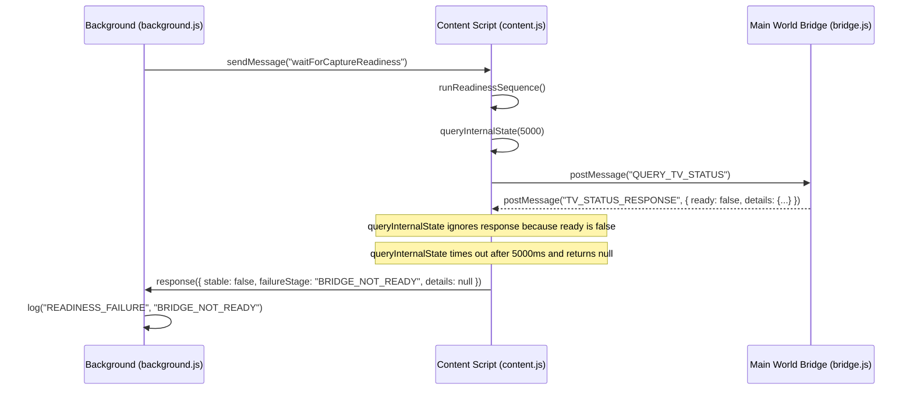

# Forensic Investigation: Bridge Readiness Failure

This report details the root cause analysis for the persistent `BRIDGE_NOT_READY` failures observed across the capture pipeline.

---

## 1. Failing Condition & Object/Property
* **File**: [content.js](file:///d:/10.%20ict-scholar-agents-V1/extension/content.js)
* **Function**: `queryInternalState()`
* **Line**: `~145`
* **Failing Condition**:
  ```javascript
  } else if (event.data.ready) {
  ```
  This condition requires the bridge's `ready` boolean to be `true` before it resolves the promise. If `ready` is `false`, the message listener ignores the status response, causing the poll loop to timeout and return `null` details.

---

## 2. Call Stack & Sequence



---

## 3. Root Cause Analysis
* **Scoping / Logic Error**: `queryInternalState()` was designed to query and retrieve the *current raw state* of TradingView (such as `mainSeriesLoading`, `drawingsLoading`, etc.) so `runReadinessSequence()` could perform stage-by-stage evaluations.
* **The Bug**: Instead of resolving on any valid response, `queryInternalState()` restricts resolution only to when `event.data.ready` is `true`. When studies, indicators, or drawings are loading, the bridge returns `ready: false`. This causes `queryInternalState()` to wait forever and timeout, returning `null`.
* **Verification Success Compatibility**: `VERIFICATION_SUCCESS` checks only symbol/timeframe metadata values extracted directly from the DOM in `updateTabAndVerify()` (which succeeds). However, the bridge status check fails subsequently because of the timeout in `queryInternalState()`.

---

## 4. Minimal Patch Location

* **Target File**: [content.js](file:///d:/10.%20ict-scholar-agents-V1/extension/content.js)
* **Function**: `queryInternalState()`
* **Target Lines**: `~141-151`
* **Correction**:
  Change the listener to resolve the promise on any valid response, passing back the details object regardless of the `ready` state:
  ```javascript
  const listener = (event) => {
    if (event.data && event.data.action === "TV_STATUS_RESPONSE") {
      resolved = true;
      window.removeEventListener("message", listener);
      if (event.data.error) {
        resolve({ error: event.data.error });
        
      } else {
        resolve(event.data.details);
      }
    }
  };
  ```
