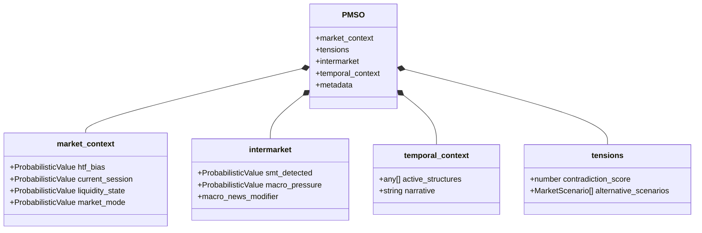
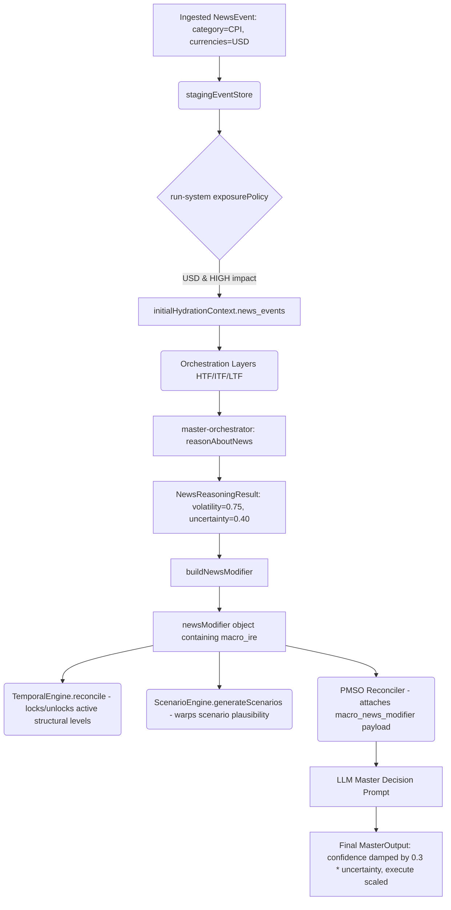
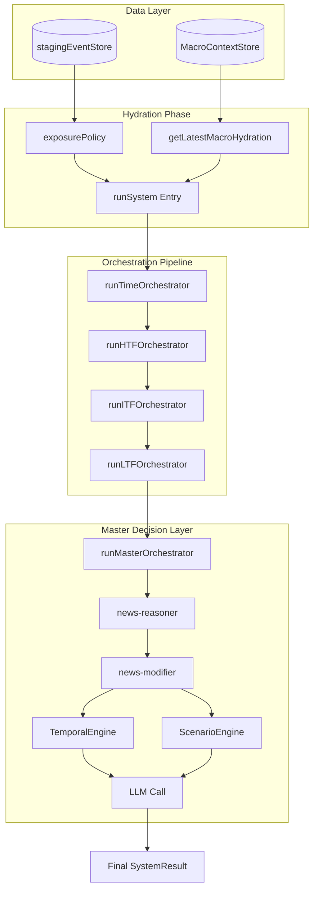
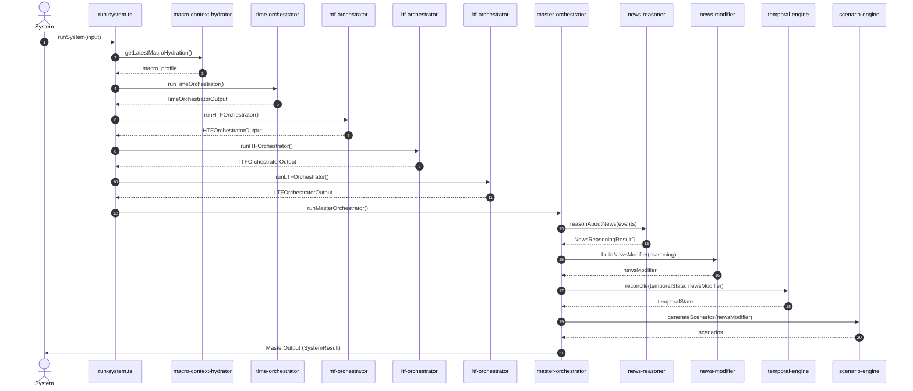
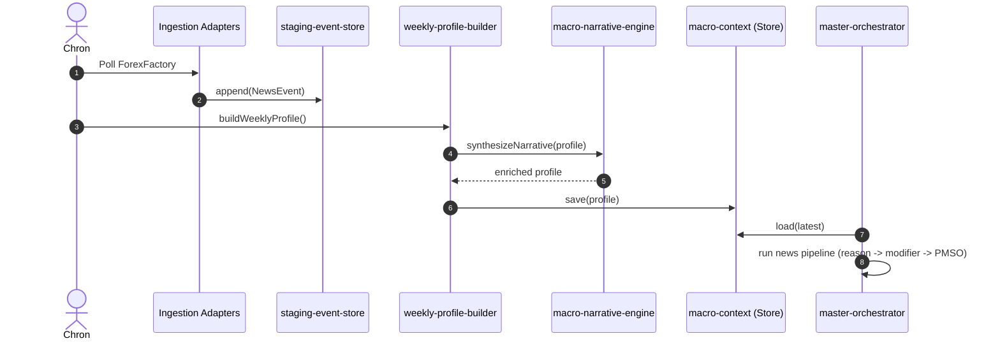
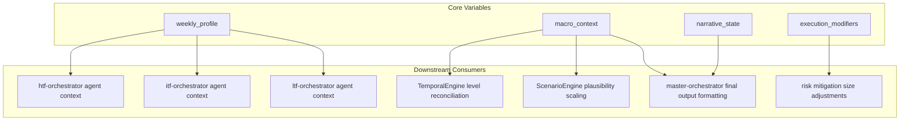

# ICT-SCHOLAR-AGENTS-V1: Comprehensive Architecture Audit

This document presents a complete, rigorous architecture audit mapping the **ACTUAL** runtime cognition flow of the system. It strictly explains current reality without proposing fixes.

---

## 1. End-to-End Query Flow

The system runs a multi-agent hierarchical analysis to synthesize a final trading decision. The runtime flow passes from the entry point down through sequential temporal/spatial layers to a master orchestrator.

### Execution Step-by-Step

#### 1. `core/4.output/run-system.ts`
* **Role**: Primary system execution entry point.
* **Input Schema**:
  ```typescript
  interface RunSystemInput {
    [symbol: string]: {
      m?: string; w?: string; d?: string; h4?: string;
      h1?: string; m15?: string; m5?: string; m1?: string;
    };
    _inheritedTemporalState?: TemporalState | null;
    macro_events?: NewsEvent[];
  }
  ```
* **Output Schema**: `SystemResult` (defined in `types/system-results.ts`)
* **Files Consumed**: `core/3.query/orchestrators/*.ts`, `core/news/cognition/macro-context-hydrator.ts`, `core/news/staging/staging-event-store.ts`, `shared/utils/validation.ts`, etc.
* **PMSO Dependencies**: Instantiates a default `PMSO` skeleton.
* **Macro-state Dependencies**: Triggers `getLatestMacroHydration()` from the hydrator, embedding it into the `HydrationContext`. Filters and exposes shadow macro/news events from `stagingEventStore` via the `exposurePolicy`.

---

#### 2. `core/3.query/pipeline-processor.ts`
* **Role**: Concept extractor and matching engine.
* **Input Schema**: Path to a JSON pipeline file (`pipelinePath`), array of `KnowledgeMapEntry` elements (`knowledgeMap`), and a `layerName` string.
* **Output Schema**: `RetrievalResult` mapping pipeline step names to matching `KnowledgeMapEntry` objects.
* **Files Consumed**: Direct file system reads of the pipeline JSON.
* **PMSO Dependencies**: None (stateless).
* **Macro-state Dependencies**: None.

---

#### 3. `core/3.query/orchestrator-input-builder.ts`
* **Role**: Data normalizer and parser for orchestrator payloads.
* **Input Schema**: Upstream orchestrator outputs (`HTFOrchestratorOutput`, `ITFOrchestratorOutput`, `LTFOrchestratorOutput`, `TimeOrchestratorOutput`) and the current `HydrationContext`.
* **Output Schema**: Zod-validated payloads: `V1_ITF_INPUT_PAYLOAD`, `V1_LTF_INPUT_PAYLOAD`, `MasterOrchestratorInputSchema`.
* **Files Consumed**: None.
* **PMSO Dependencies**: Passes `PMSO` wrapped inside `hydration_context.pmso_context`.
* **Macro-state Dependencies**: Propagates `hydrationContext` (carrying macro contexts) forward.

---

#### 4. `core/3.query/orchestrators/time-orchestrator.ts`
* **Role**: Temporal boundary gate. Evaluates sessions and macro time regimes.
* **Input Schema**: `TimeOrchestratorInput` containing symbol timeframe data, along with `HydrationContext`.
* **Output Schema**: `TimeOrchestratorOutput` (`trading_window: "active" | "inactive"`, `timing_bias`, `expectation`, `confidence`, `narrative`).
* **Files Consumed**: Calls time agents (`session-agent.ts`, `macro-time-agent.ts`, `monthly-agent.ts`, `weekly-agent.ts`, `daily-agent.ts`, `quarterly-agent.ts`).
* **PMSO Dependencies**: None.
* **Macro-state Dependencies**: Evaluates inputs through the `macroTimeAgent`.

---

#### 5. `core/3.query/orchestrators/htf-orchestrator.ts`
* **Role**: Higher timeframe context validator and relational context builder.
* **Input Schema**: `HTFOrchestratorInput` and `HydrationContext`.
* **Output Schema**: `HTFOrchestratorOutput & { hydrationContext: HydrationContext }`.
* **Files Consumed**: Calls HTF agents (`htfStructureAgent`, `htfMacroAgent`, `htfLiquidityAgent`, `htfPDArrayAgent`).
* **PMSO Dependencies**: Performs Phase 2 time-layer hydration by writing a `current_session` delta. Reconciles daily structures to write `htf_bias`, `market_mode`, and `liquidity_state` into the `PMSO` context.
* **Macro-state Dependencies**: Receives compact macro summary at agent level. Extracts yields/DXY macro factors to generate DXY/Yields `ExternalInfluence` in the `RelationalContext`.

---

#### 6. `core/3.query/orchestrators/itf-orchestrator.ts`
* **Role**: Intermediate timeframe setup detector.
* **Input Schema**: `ITFOrchestratorInput` (including `htf` payload) and `HydrationContext`.
* **Output Schema**: `ITFOrchestratorOutput & { hydrationContext: HydrationContext }`.
* **Files Consumed**: Calls ITF agents (`itfStructureAgent`, `itfLiquidityAgent`, `itfPDArrayAgent`, `itfSetupAgent`).
* **PMSO Dependencies**: Reads `PMSO` from `hydrationContext.pmso_context`.
* **Macro-state Dependencies**: Receives `macro_news_summary` from hydration context.

---

#### 7. `core/3.query/orchestrators/ltf-orchestrator.ts`
* **Role**: Lower timeframe trigger evaluator.
* **Input Schema**: `LTFOrchestratorInput` (including `htf`, `itf` payloads) and `HydrationContext`.
* **Output Schema**: `LTFOrchestratorOutput & { hydrationContext: HydrationContext }`.
* **Files Consumed**: Calls LTF agents (`ltfStructureAgent`, `ltfLiquidityAgent`, `ltfPDArrayAgent`, `ltfTriggerAgent` sequentially).
* **PMSO Dependencies**: Reads `PMSO` from `hydrationContext.pmso_context`.
* **Macro-state Dependencies**: Receives compact `macro_news_summary` from hydration context.

---

#### 8. `core/3.query/scenario-engine.ts`
* **Role**: Alternative scenario branch generator.
* **Input Schema**: `HierarchicalMemory`, retrieved chunks, `captureId`, and optional `newsModifier`.
* **Output Schema**: `ScenarioMemory` (active and archived scenarios, uncertainty notes).
* **Files Consumed**: None.
* **PMSO Dependencies**: Reconciles alternative scenarios, which are loaded into `pmso.tensions.alternative_scenarios`.
* **Macro-state Dependencies**: Plausibility rankings are perturbed using `newsModifier` uncertainty and macro bias parameters.

---

#### 9. `core/3.query/orchestrators/master-orchestrator.ts`
* **Role**: Final trade reconciler and decision engine.
* **Input Schema**: `MasterOrchestratorInput` and `HydrationContext`.
* **Output Schema**: `MasterOutput` (incorporating `decision`, `layers`, `metadata`, `_pmso`).
* **Files Consumed**: Reconcilers (`reconciler.ts`), `ScenarioEngine`, `TemporalEngine`, `news-modifier.ts`, `news-reasoner.ts`.
* **PMSO Dependencies**: Reads and reconciles all raw agent facts into the final Master `PMSO` representation. Writes `pmso.intermarket.macro_news_modifier`. Persists the final PMSO under `pmso/${captureId}.json`.
* **Macro-state Dependencies**: Calls `reasonAboutNews` for every active macro event to construct `groundedReasoning`, runs `buildNewsModifier` to generate a unified `newsModifier`, feeds it to `TemporalEngine.reconcile` and `ScenarioEngine.generateScenarios`, and uses the final risk pressures to damp output confidence or disable execution.

---

## 2. PMSO Audit

The Probabilistic Market State Object (PMSO) represents the system's complete, reconciled understanding of the market. Below are the precise schemas, lifecycles, and access parameters of its core sub-states.



### State Schemas & Lifecycles

#### A. Temporal State Schema
Located in `shared/knowledge/temporal-types.ts` as `TemporalState`:
* **Fields**:
  * `structures: ActiveStructure[]` (fvgs, obs, breakers, sweeps with price bounds, mitigation levels, decay scores)
  * `narrative_continuity: string`
  * `session_id: string`
  * `last_updated: string`
  * `capture_count: number`
  * `invalidation_summary?: { total_invalidations: number, last_invalidated_at: string | null }`
  * `regime_state?: "STABLE" | "TRANSITIONAL" | "CHAOTIC"`
  * `last_reconciled_capture_id?: string`
* **Lifecycle**:
  * **Creation**: Loaded from `input._inheritedTemporalState` or initialized null.
  * **Reconciliation**: Mutated in `master-orchestrator.ts` by `TemporalEngine.reconcile` utilizing new agent facts and the `newsModifier` to adjust structure states.
  * **Persistence**: Persisted using `StorageService.persistAnalysisOutput("master", "temporal-state", temporalState)`.

#### B. Macro Context Schema
Located in `core/news/macro-context.ts` as `MacroContextState`:
* **Fields**:
  * `week_start: string`
  * `week_type: string` (e.g. CPI, NFP, FOMC, GENERIC)
  * `primary_drivers: string[]`
  * `volatility_expectation: "LOW" | "MEDIUM" | "HIGH"`
  * `delivery_model: string`
  * `macro_bias: "bullish" | "bearish" | "neutral"`
  * `narrative_confidence: number`
  * `active_events: Array<{ id: string, title?: string, scheduled_time?: string, impact?: string }>`
  * `upcoming_events: Array<{ id: string, title?: string, scheduled_time?: string, impact?: string }>`
  * `retrieval_context: RetrievalContext`
  * `narrative_state: string`
  * `regime: Regime`
  * `narrative_history: NarrativeSnapshot[]`
  * `adaptation_history?: AdaptationSnapshot[]`
  * `confidence_evolution?: ConfidenceSnapshot[]`
* **Lifecycle**:
  * **Creation**: Assembled in `weekly-profile-builder.ts` -> `buildWeeklyProfile()`.
  * **Hydration**: Retrieved via `getLatestMacroHydration()` and embedded in the orchestrator's initial context.
  * **Persistence**: Saved via `MacroContextStore.save(state)` to `data/calendar_cache/macro_profiles/`.

#### C. Narrative State Schema
Embedded inside `MacroContextState` as `narrative_state` (string) and historical snapshot arrays (`narrative_history: NarrativeSnapshot[]`):
* **Fields**:
  * `ts: string`
  * `narrative: string`
  * `confidence: number`
* **Lifecycle**:
  * **Creation**: Synthesized via `synthesizeNarrative(...)` in `macro-narrative-engine.ts` utilizing RAG chunk token search heuristics.
  * **Propagation**: Embedded in the downstream `initialHydrationContext.macro_narrative` to serve as directional bias guidance.

#### D. Weekly Profile Schema
Equivalent to `MacroContextState` (persisted under `data/calendar_cache/macro_profiles/<weekStartIso>.json`).
* **Lifecycle**:
  * **Creation**: Executed via script `run-weekly-builder.ts` or during testing.
  * **Lifetime**: Lives as a static profile file read sequentially by multiple runs within the week.

### Access Map

| State | Write Locations | Read Locations | Overwrite Locations |
| :--- | :--- | :--- | :--- |
| **Temporal State** | `master-orchestrator.ts:L931` (via `TemporalEngine.reconcile`) | `run-system.ts:L31`, `master-orchestrator.ts:L713`, `master-orchestrator.ts:L911` | `master-orchestrator.ts:L931` (Replaces previous version) |
| **Macro Context** | `weekly-profile-builder.ts:L130` | `macro-context-hydrator.ts:L11` | `weekly-profile-builder.ts:L130` (Saves with incremented version) |
| **Narrative State** | `macro-narrative-engine.ts:L5` | `macro-context-hydrator.ts:L21`, `run-system.ts:L301`, `master-orchestrator.ts:L57` | `macro-narrative-engine.ts:L48` (Pushed to history and updated on active profile) |
| **Weekly Profile** | `weekly-profile-builder.ts:L130` | `macro-context-hydrator.ts:L5` | `weekly-profile-builder.ts:L130` |

---

## 3. News Architecture Audit

The news architecture processes macroeconomic events, schedules their active windows, creates narrative biases, and pushes risk pressures into the primary execution system.

```
+-----------------------------------------------------------+
|                      INGESTION                            |
|  forexfactory / finnhub news adapters                      |
+-----------------------------------------------------------+
                              |
                              v (NewsEvent)
+-----------------------------------------------------------+
|                      CALENDAR                             |
|  macro-calendar-state.ts (MacroReleaseEvent)              |
+-----------------------------------------------------------+
                              |
                              v
+-----------------------------------------------------------+
|                      WINDOWING                            |
|  windowing.ts (computes pre/post/cooldown windows)        |
+-----------------------------------------------------------+
                              |
                              v (Active Events)
+-----------------------------------------------------------+
|                  STAGING_EVENT_STORE                      |
|  staging-event-store.ts (production vs shadow partitions)  |
+-----------------------------------------------------------+
         |                                           |
         v (Exposed Shadow Events)                   v (Latest Calendar Week)
+------------------------+                 +------------------------+
|   NEWS_EXPOSURE_POLICY |                 | WEEKLY_PROFILE_BUILDER |
|  Filters USD/EUR/GBP   |                 | Classifies week type,  |
|  and high impact.      |                 | retrieves RAG chunks.  |
+------------------------+                 +------------------------+
         |                                           |
         |                                           v
         |                                 +------------------------+
         |                                 | MACRO_NARRATIVE_ENGINE |
         |                                 | Synthesizes regime     |
         |                                 | & macro bias.          |
         |                                 +------------------------+
         |                                           |
         |                                           v (MacroContextState)
         |                                 +------------------------+
         |                                 | MACRO_CONTEXT_STORE    |
         |                                 | Persists profile.      |
         |                                 +------------------------+
         |                                           |
         |                                           v
         |                                 +------------------------+
         |                                 | MACRO_CONTEXT_HYDRATOR |
         |                                 | Loads latest profile.  |
         |                                 +------------------------+
         |                                           |
         v (news_events)                             v (macro_profile)
+-----------------------------------------------------------+
|                INITIAL HYDRATION CONTEXT                  |
+-----------------------------------------------------------+
                              |
                              v (Through Orchestration Layers)
+-----------------------------------------------------------+
|                    MASTER ORCHESTRATOR                    |
| - reasonAboutNews (generates NewsReasoningResult)         |
| - buildNewsModifier (aggregates pressures)                |
| - PMSOReconciler.reconcile (hydrates intermarket PMSO)     |
+-----------------------------------------------------------+
```

### Runtime Objects Transition Example

#### 1. Ingested Event (`NewsEvent`)
```json
{
  "id": "event_usd_cpi_2026_05_29",
  "timestamp": 1780000000000,
  "title": "Core CPI m/m",
  "source": "forexfactory",
  "category": "CPI",
  "importance": "HIGH",
  "currencies_affected": ["USD"],
  "volatility_class": "EXPANSIONARY",
  "persistence": "REGIME",
  "repricing_direction": "USD_BULLISH",
  "confidence": 0.9
}
```

#### 2. Calendar Event (`MacroReleaseEvent`)
Ingestion converts raw news events into calendar structures and applies `computeWindowsForEvent` to derive boundaries:
```json
{
  "id": "event_usd_cpi_2026_05_29",
  "name": "Core CPI m/m",
  "category": "CPI",
  "currency": "USD",
  "impact": "HIGH",
  "scheduled_time": "2026-05-29T12:30:00Z",
  "volatility_risk": 0.85,
  "window_boundaries": {
    "pre_start": "2026-05-29T11:30:00-04:00",
    "pre_end": "2026-05-29T12:30:00-04:00",
    "post_start": "2026-05-29T12:30:00-04:00",
    "post_end": "2026-05-29T13:30:00-04:00",
    "cooldown_end": "2026-05-29T15:30:00-04:00"
  },
  "lifecycle_phase": "ACTIVE"
}
```

#### 3. Staging Storage
Event is written to `stagingEventStore.shadowEvents` or `productionEvents`.

#### 4. Retrieval & Synthesis (`buildWeeklyProfile` -> `synthesizeNarrative`)
Retrieves supporting vector database chunks and produces a `MacroContextState` profile:
```json
{
  "week_start": "2026-05-25T00:00:00Z",
  "week_type": "CPI",
  "primary_drivers": ["CPI", "PMI"],
  "volatility_expectation": "HIGH",
  "macro_bias": "bullish",
  "narrative_confidence": 0.82,
  "active_events": [{"id": "event_usd_cpi_2026_05_29", "title": "Core CPI m/m", "scheduled_time": "2026-05-29T12:30:00Z", "impact": "HIGH"}],
  "narrative_state": "Week 2026-05-25T00:00:00Z: CPI — bias=bullish; expect high volatility.",
  "regime": { "volatility": "HIGH", "liquidity": "STABLE", "macro_alignment": "NEUTRAL" }
}
```

#### 5. Grounded Reasoning (`reasonAboutNews` output `NewsReasoningResult`)
During `runMasterOrchestrator`, the exposed events are fed to `reasonAboutNews`:
```json
{
  "event_id": "event_usd_cpi_2026_05_29",
  "grounded": true,
  "grounding_source": "evidence_backed",
  "volatility_pressure": 0.75,
  "uncertainty_pressure": 0.40,
  "directional_pressure": 0.35,
  "chunk_citations": ["chunk_312", "chunk_885"],
  "evidence_summaries": ["US inflation structures show upward momentum."]
}
```

#### 6. Aggregated news modifier (`buildNewsModifier` output)
```json
{
  "volatility_pressure": 0.75,
  "uncertainty_pressure": 0.40,
  "directional_alignment": "ALIGNS",
  "macro_context": {
    "active_event": "event_usd_cpi_2026_05_29",
    "phase": "ACTIVE",
    "impact": "HIGH",
    "expected_volatility": "ELEVATED",
    "macro_bias": "bullish",
    "execution_modifier": { "reduce_size": true, "avoid_pre_news_entry": true },
    "confidence_modifier": -0.40,
    "narrative": "Macro/news conditioning active (ALIGNS). Expected volatility=0.75..."
  },
  "macro_ire": {
    "bias": "bullish",
    "volatility_regime": "ELEVATED",
    "execution_risk": "HIGH",
    "liquidity_condition": "UNSTABLE",
    "confidence_modifier": -0.40,
    "narrative_alignment": "ALIGNED",
    "event_phase": "ACTIVE",
    "execution_modifier": { "reduce_size": true, "avoid_pre_news_entry": true }
  }
}
```

#### 7. Final PMSO Output (`pmso.intermarket.macro_news_modifier` & news artifacts)
Persisted inside PMSO and written as structured outputs (`analysis/news/macro-context.json`, etc.).

---

## 4. Macro Force Propagation Audit

The table below maps where macro cognition is created, where it is written, who consumes it, and under what conditions it becomes diluted or lost.

| Producer | Artifact | Consumer | Status |
| :--- | :--- | :--- | :--- |
| `weekly-profile-builder` | `MacroContextState` | `macro-context-hydrator` | **Active**: Saved as a JSON profile in the calendar cache folder. |
| `macro-context-hydrator` | Hydration Payload | `run-system` | **Active**: Compacted payload is loaded into `initialHydrationContext`. |
| `run-system` | `initialHydrationContext` | `time-orchestrator`, `htf-orchestrator`, `itf-orchestrator`, `ltf-orchestrator` | **Active**: Carries the macro narrative and exposed events to the individual agents. |
| `htf-orchestrator` | `RelationalContext` & HTF PMSO hydration | `itf-orchestrator` -> `ltf-orchestrator` | **Active**: Propagates parsed DXY/Yield pressures downstream. |
| `master-orchestrator` (`reasonAboutNews` -> `buildNewsModifier`) | Unified `newsModifier` | `TemporalEngine`, `ScenarioEngine`, final output formatting | **Active**: Pressures are directly injected into temporal structures, scenarios, and damp execution. |
| LLM inside `master-orchestrator` | `generateMasterDecision` prompt | LLM decision engine | **Diluted/Lost**: If the LLM generates a malformed JSON schema that fails Zod parsing, the canonical Master layer falls back to a structural LTF output, losing the blended macro-narrative constraints. |
| `master-orchestrator` | `finalOutput` | System caller | **Lost/Inactive**: If `trading_window === "inactive"` (Time Gate closed), the execution is forced `false` and state becomes `NO_TRADE`, overriding all underlying bullish/bearish macro pressure alignments. |

---

## 5. Runtime Trace

Here is a trace of a macro event (`event_usd_cpi_2026_05_29`) traversing the system:



### Trace Details
1. **Exposure Gate**: Exposes the `CPI` event to the system.
2. **Pressures Generation**: `reasonAboutNews` references grounding chunks to determine `volatility_pressure = 0.75` and `uncertainty_pressure = 0.40`.
3. **News Modifier Blending**: `buildNewsModifier` aggregates these pressures, creating the `macro_ire` instructions: `{ avoid_pre_news_entry: true, reduce_size: true }`.
4. **Temporal Integration**: `TemporalEngine` uses this modifier to decay structural level confidence.
5. **Scenario Integration**: `ScenarioEngine` adjusts the Continuation scenario plausibility up by `+0.07` (due to `ALIGNS` bullish bias) and subtracts `0.20` uncertainty penalty.
6. **Execution Control**: `master-orchestrator` clamps final confidence from `0.85` down to `0.85 * (1 - 0.40 * 0.3) = 0.748`. Because `volatility_pressure` (`0.75`) is below the threshold `0.80`, execution remains `true` (but size will be reduced).

---

## 6. Diagrams & Dependency Graphs

### A. System Architecture Diagram



### B. Complete Runtime Sequence Diagram



### C. Macro-Cognition Sequence Diagram



### D. Dependency Graph: Core States Downstream Consumers

The graph below highlights how the primary variables `macro_context`, `weekly_profile`, `narrative_state`, and `execution_modifiers` feed downstream components.


